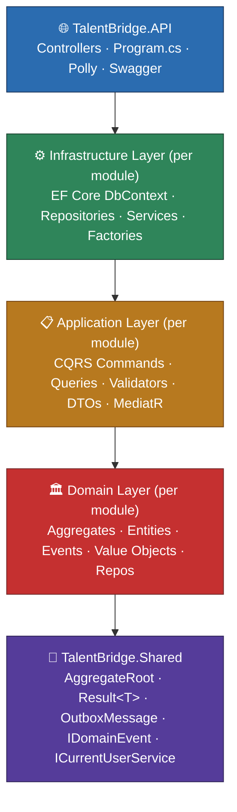
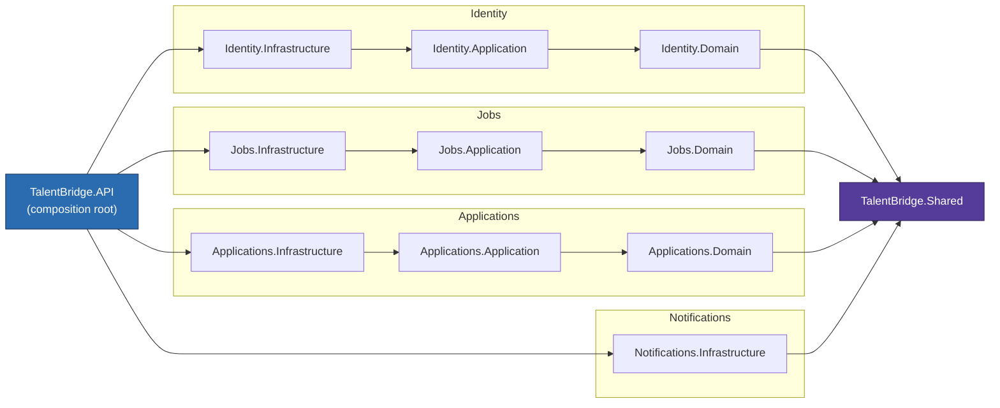
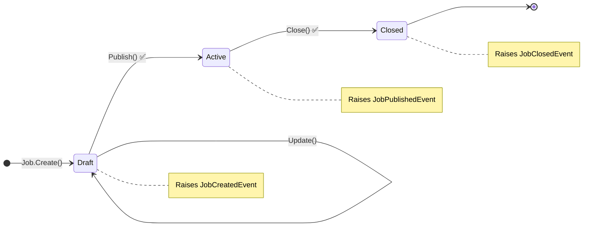
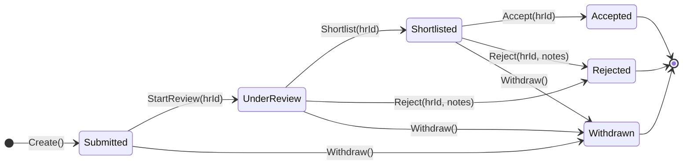
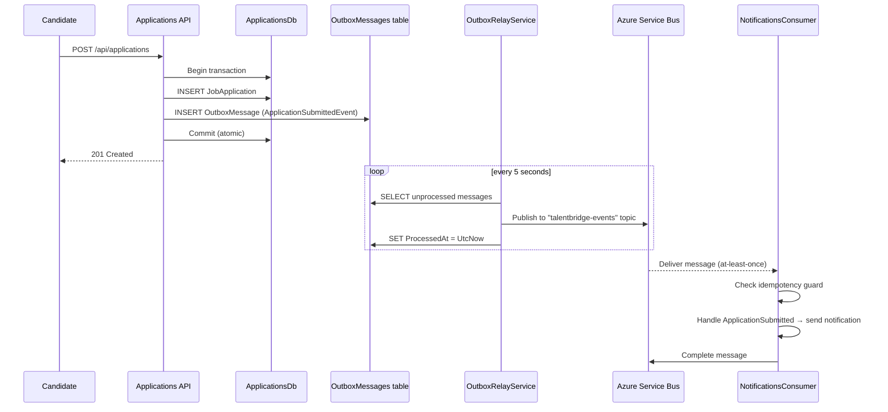
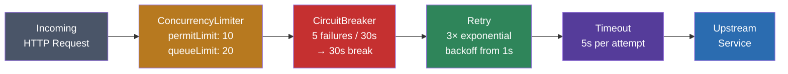

# TalentBridge — Enterprise Hiring Platform: Design Document

## Quick Reference

**Repo:** https://github.com/amey2612/talentbridge-dotnet

### Bounded Contexts, Aggregates & Async Flows

```
Bounded Contexts: Identity | Jobs | Applications | Companies | Notifications

Aggregates:
  Job          — Draft→Active→Closed (raises JobCreated/Published/Closed events)
  JobApplication — Submitted→UnderReview→Accepted/Rejected
  User         — BCrypt hash, JWT claims, role: Candidate/CompanyHR/Admin

Async Flows:
  Apply()  → saves JobApplication + OutboxMessage in one DB transaction
           → OutboxRelayService polls every 5s → publishes to Service Bus topic
           → TalentBridgeEventConsumer (BackgroundService) handles with idempotency guard

Resilience (HttpClient):
  ConcurrencyLimiter(10/20) → CircuitBreaker(5 failures/30s) → Retry(3x exp) → Timeout(5s)
```

### Solution Layout

```
TalentBridge/
├── .github/workflows/
│   ├── ci.yml                              ← auto-runs on push
│   └── deploy.yml                          ← manual workflow_dispatch
├── docs/
│   ├── SOLUTION-BICEP-IAC.md
│   └── ScreenShots/Azure.png
├── frontend/
│   ├── index.html                          ← API explorer SPA
│   └── staticwebapp.config.json
├── infra/
│   ├── main.bicep
│   ├── deploy.sh
│   ├── modules/  (appinsights, containerapp, keyvault, servicebus, sql, staticwebapp, storage)
│   └── parameters/  dev.bicepparam  prod.bicepparam
├── src/
│   ├── API/TalentBridge.API/               ← Controllers, Program.cs, Polly
│   ├── Shared/TalentBridge.Shared/         ← AggregateRoot<TId>, Result<T>, OutboxMessage, IDomainEvent
│   └── Modules/
│       ├── Identity/    Domain | Application | Infrastructure
│       ├── Companies/   Domain | Application | Infrastructure
│       ├── Jobs/        Domain | Application | Infrastructure
│       ├── Applications/Domain | Application | Infrastructure
│       └── Notifications/Domain | Application | Infrastructure
├── tests/
│   ├── TalentBridge.Jobs.Domain.Tests         (8 tests)
│   ├── TalentBridge.Applications.Domain.Tests (8 tests)
│   └── TalentBridge.Identity.Domain.Tests     (7 tests)
└── TalentBridge.slnx   (20 projects, 0 errors, 23/23 tests passing)
```

### Detailed Folder Structure

```
TalentBridge/
├── src/
│   ├── API/
│   │   └── TalentBridge.API/
│   │       ├── Controllers/
│   │       │   ├── ApplicationsController.cs
│   │       │   ├── AuthController.cs
│   │       │   ├── JobsController.cs
│   │       │   └── ResumesController.cs
│   │       ├── Resilience/
│   │       │   ├── ResilienceEndpoints.cs
│   │       │   └── TalentBridgeResiliencePolicies.cs
│   │       ├── Program.cs
│   │       ├── appsettings.json
│   │       └── appsettings.Development.json
│   │
│   ├── Shared/
│   │   └── TalentBridge.Shared/
│   │       ├── Common/
│   │       │   └── Result.cs                ← Result<T> + non-generic Result
│   │       ├── Domain/
│   │       │   ├── AggregateRoot.cs         ← AggregateRoot<TId> + AggregateRoot alias
│   │       │   ├── BaseEntity.cs
│   │       │   └── IDomainEvent.cs          ← : INotification (MediatR)
│   │       ├── Interfaces/
│   │       │   └── ICurrentUserService.cs
│   │       └── Outbox/
│   │           └── OutboxMessage.cs         ← Type, OccurredOnUtc, ProcessedOnUtc
│   │
│   └── Modules/
│       │
│       ├── Identity/
│       │   ├── TalentBridge.Identity.Domain/
│       │   │   ├── Entities/
│       │   │   │   └── User.cs              ← : AggregateRoot, Result<User>.Create, RefreshToken
│       │   │   ├── Enums/
│       │   │   │   └── UserRole.cs
│       │   │   ├── Events/
│       │   │   │   └── UserRegisteredEvent.cs
│       │   │   └── Repositories/
│       │   │       └── IUserRepository.cs
│       │   ├── TalentBridge.Identity.Application/
│       │   │   ├── Commands/Login/
│       │   │   │   ├── LoginCommand.cs
│       │   │   │   └── LoginCommandHandler.cs
│       │   │   ├── Commands/Register/
│       │   │   │   ├── RegisterCommand.cs
│       │   │   │   └── RegisterCommandHandler.cs
│       │   │   └── Interfaces/
│       │   │       ├── IIdentityDbContext.cs
│       │   │       └── ITokenService.cs
│       │   └── TalentBridge.Identity.Infrastructure/
│       │       ├── Migrations/
│       │       ├── Persistence/
│       │       │   ├── IdentityDbContext.cs
│       │       │   ├── IdentityDbContextFactory.cs
│       │       │   └── UserRepository.cs
│       │       └── Services/
│       │           ├── CurrentUserService.cs
│       │           └── TokenService.cs
│       │
│       ├── Companies/
│       │   ├── TalentBridge.Companies.Domain/
│       │   │   ├── Entities/
│       │   │   │   └── Company.cs           ← Create, Approve, UpdateProfile
│       │   │   └── Events/
│       │   │       ├── CompanyCreatedEvent.cs
│       │   │       └── CompanyApprovedEvent.cs
│       │   ├── TalentBridge.Companies.Application/   ← Brief 03 placeholder
│       │   └── TalentBridge.Companies.Infrastructure/ ← Brief 03 placeholder
│       │
│       ├── Jobs/
│       │   ├── TalentBridge.Jobs.Domain/
│       │   │   ├── Aggregates/
│       │   │   │   └── Job.cs              ← Result<Job>.Create, PostedByHRId, ExpiresAtUtc
│       │   │   ├── Enums/
│       │   │   │   ├── JobStatus.cs
│       │   │   │   └── JobType.cs
│       │   │   ├── Events/
│       │   │   │   ├── JobCreatedEvent.cs
│       │   │   │   ├── JobPublishedEvent.cs
│       │   │   │   └── JobClosedEvent.cs
│       │   │   └── Repositories/
│       │   │       └── IJobRepository.cs
│       │   ├── TalentBridge.Jobs.Application/
│       │   │   ├── Commands/CloseJob/
│       │   │   ├── Commands/PostJob/
│       │   │   ├── Commands/PublishJob/
│       │   │   ├── DTOs/JobDto.cs
│       │   │   └── Queries/GetJobById/ + SearchJobs/
│       │   └── TalentBridge.Jobs.Infrastructure/
│       │       ├── Migrations/
│       │       └── Persistence/
│       │           ├── JobRepository.cs
│       │           └── JobsDbContext.cs
│       │
│       ├── Applications/
│       │   ├── TalentBridge.Applications.Domain/
│       │   │   ├── Aggregates/
│       │   │   │   └── JobApplication.cs   ← Submitted→UnderReview→Shortlisted→Accepted/Rejected/Withdrawn
│       │   │   ├── Enums/
│       │   │   │   └── ApplicationStatus.cs  ← Submitted, UnderReview, Shortlisted, Accepted, Rejected, Withdrawn
│       │   │   ├── Events/
│       │   │   │   ├── ApplicationSubmittedEvent.cs
│       │   │   │   ├── ApplicationStatusChangedEvent.cs
│       │   │   │   ├── ApplicationAcceptedEvent.cs
│       │   │   │   └── ApplicationWithdrawnEvent.cs
│       │   │   └── Repositories/
│       │   │       └── IApplicationRepository.cs
│       │   ├── TalentBridge.Applications.Application/
│       │   │   ├── Commands/Apply/
│       │   │   ├── Commands/UpdateStatus/
│       │   │   ├── Commands/UploadResume/
│       │   │   └── Queries/GetApplication/
│       │   └── TalentBridge.Applications.Infrastructure/
│       │       ├── Migrations/
│       │       ├── Persistence/
│       │       └── Storage/AzureResumeStorageService.cs
│       │
│       └── Notifications/
│           ├── TalentBridge.Notifications.Domain/
│           │   └── Entities/
│           │       └── NotificationRecord.cs
│           ├── TalentBridge.Notifications.Application/  ← placeholder
│           └── TalentBridge.Notifications.Infrastructure/
│               ├── Consumers/TalentBridgeEventConsumer.cs
│               ├── Relay/
│               │   ├── OutboxRelayService.cs
│               │   ├── OutboxRepository.cs
│               │   └── RelayDbContext.cs
│               └── Services/InMemoryProcessedMessageStore.cs
│
├── tests/
│   ├── TalentBridge.Jobs.Domain.Tests/
│   │   └── JobTests.cs                     (8 tests)
│   ├── TalentBridge.Applications.Domain.Tests/
│   │   └── JobApplicationTests.cs          (8 tests)
│   └── TalentBridge.Identity.Domain.Tests/
│       └── UserTests.cs                    (7 tests)
│
├── Dockerfile
├── TalentBridge.slnx
├── DESIGN.md
└── README.md
```

---

## Overview

TalentBridge is a **modular monolith** built with **.NET 10 / ASP.NET Core 10** following **Clean Architecture** principles and **Domain-Driven Design** patterns. Five bounded contexts (Identity, Jobs, Applications, Companies, Notifications) live in one deployable unit but are structured for eventual extraction into microservices.

---

## Architecture

### Clean Architecture Layers



**Dependency rule**: inner layers never reference outer layers. Infrastructure implements interfaces defined in Application.

---

### Module Dependency Graph



---

### Aggregate State Machines





---

### Async Flow — Apply for a Job (Outbox Pattern)



---

### Polly Resilience Pipeline



---

## Module Structure (20 projects)

| Module | Domain | Application | Infrastructure |
|--------|--------|-------------|---------------|
| Identity | `User` (AggregateRoot), `UserRole`, `UserRegisteredEvent` | Login, Register, JWT | `IdentityDbContext`, BCrypt, JWT |
| Companies | `Company` (Create/Approve/UpdateProfile), `CompanyCreatedEvent`, `CompanyApprovedEvent` | Brief 03 placeholder | Brief 03 placeholder |
| Jobs | `Job` (Result<Job>.Create), `JobStatus`, events | PostJob, PublishJob, CloseJob, GetJob, SearchJobs | `JobsDbContext`, `JobRepository` |
| Applications | `JobApplication` (6-state machine), `ApplicationStatus` (6 values), events | Apply, UpdateStatus, UploadResume, GetApplication | `ApplicationsDbContext`, Blob Storage |
| Notifications | `NotificationRecord` | (listens to outbox) | Service Bus consumer + Outbox relay |
| **Shared** | `AggregateRoot<TId>`, `BaseEntity`, `IDomainEvent : INotification`, `OutboxMessage`, `Result<T>`, `Result`, `ICurrentUserService` | — | — |
| **API** | — | — | Controllers, Program.cs, Polly pipeline |

---

## Key Technical Decisions

### 1. Shared Kernel
- `AggregateRoot<TId>` — generic; non-generic `AggregateRoot` is a `AggregateRoot<Guid>` alias. Events raised via `RaiseDomainEvent()`, cleared after persistence
- `IDomainEvent : INotification` — MediatR integration; all events carry `EventId` + `OccurredOnUtc`
- `Result<T>` / `Result` — railway-oriented error handling; avoids exceptions for business rule failures
- `OutboxMessage` — Id, Type, Payload (JSON), OccurredOnUtc, ProcessedOnUtc

### 2. CQRS with MediatR v14
Every user action is a `IRequest<T>` command or query. FluentValidation pipeline behavior validates before the handler runs. Three assembly scans in `Program.cs` cover all modules.

### 3. Outbox Pattern (Applications module)
```
Begin DB transaction
  → Save JobApplication
  → Save OutboxMessage (serialized domain event)
Commit atomically
                    ↓ (5-second poll)
OutboxRelayService reads unprocessed messages
  → Publishes to Azure Service Bus topic "talentbridge-events"
  → Marks ProcessedAt = UtcNow on success
  → Increments RetryCount on failure
```
This guarantees **at-least-once delivery** without distributed transactions.

### 4. HybridCache (L1 + L2)
```csharp
// L1 = in-process IMemoryCache (2 min)
// L2 = distributed cache (10 min for job, 5 min for search)
await _cache.GetOrCreateAsync($"job:{jobId}", factory, new HybridCacheEntryOptions
{
    Expiration = TimeSpan.FromMinutes(10),
    LocalCacheExpiration = TimeSpan.FromMinutes(2)
});
```

### 5. Polly v8 Resilience Pipeline
Applied to named `HttpClient("TalentBridgeClient")` via `Microsoft.Extensions.Http.Resilience`:

```
Request
  → ConcurrencyLimiter (permitLimit:10, queueLimit:20)   [bulkhead]
  → CircuitBreaker (5 failures in 30s → 30s break)
  → Retry (3x, exponential backoff starting 1s)
  → Timeout (5s per attempt)
```

Wrap order ensures retries don't fight the timeout: each attempt gets a fresh 5s timeout, the circuit breaker sees all failure-after-retry outcomes.

### 6. Identity — JWT HS256
- Token lifetime: 8 hours
- Claims: `NameIdentifier`, `Email`, `Role`, `firstName`, `companyId` (HR only)
- Password: BCrypt.Net-Next with work factor 11 (default)
- Unique email index enforced at DB level

### 7. Azure Blob Storage (Resumes)
- Container: `resumes-talentbridge-amey`
- Allowed extensions: `.pdf`, `.doc`, `.docx`
- Max size: 5 MB
- Blob path: `{candidateId}/{newGuid}-{originalFileName}`

### 8. Azure Service Bus (Notifications)
- Topic: `talentbridge-events`
- Subscription: `notifications`
- Max concurrent calls: 5
- Auto-complete: false (explicit Complete/Abandon for idempotency)
- Idempotency guard: `InMemoryProcessedMessageStore` (ConcurrentDictionary)

---

## Security

| Concern | Implementation |
|---------|----------------|
| Authentication | JWT Bearer (HS256) |
| Authorization | Role-based: `Candidate`, `CompanyHR`, `Admin` |
| Password storage | BCrypt hash (never stored in plain text) |
| Secret management | All secrets externalized — `appsettings.json` values are `SET_IN_KEYVAULT` |
| Input validation | FluentValidation on all commands |
| File upload | Extension allow-list + 5 MB size cap |

---

## Database Schema Summary

### IdentityDb (`TalentBridgeIdentity`)
| Table | Columns |
|-------|---------|
| Users | Id, Email (unique), PasswordHash, FirstName, LastName, Role, CompanyId, IsActive, LastLoginAt, CreatedAt, UpdatedAt |

### JobsDb (`TalentBridgeJobs`)
| Table | Columns |
|-------|---------|
| Jobs | Id, Title, Description, CompanyId, PostedById, SalaryMin, SalaryMax, Currency, Location, Status, Type, RequiredSkills (JSON), ExpiresAt, CreatedAt, UpdatedAt |
| JobsOutboxMessages | Id, EventType, Payload, CreatedAt, ProcessedAt, RetryCount, Error |

### ApplicationsDb (`TalentBridgeApplications`)
| Table | Columns |
|-------|---------|
| JobApplications | Id, JobId, CandidateId, CoverLetter, ResumeUrl, Status, RejectionReason, CreatedAt, UpdatedAt |
| ApplicationsOutboxMessages | Id, EventType, Payload, CreatedAt, ProcessedAt, RetryCount, Error |

---

## API Endpoints

### Auth
| Method | Route | Auth |
|--------|-------|------|
| POST | `/api/auth/register` | Anonymous |
| POST | `/api/auth/login` | Anonymous |

### Jobs
| Method | Route | Auth |
|--------|-------|------|
| POST | `/api/jobs` | CompanyHR, Admin |
| GET | `/api/jobs/{id}` | Anonymous |
| GET | `/api/jobs/search` | Anonymous |
| POST | `/api/jobs/{id}/publish` | CompanyHR |
| POST | `/api/jobs/{id}/close` | CompanyHR, Admin |

### Applications
| Method | Route | Auth |
|--------|-------|------|
| POST | `/api/applications` | Candidate |
| GET | `/api/applications/{id}` | Authenticated |
| PATCH | `/api/applications/{id}/status` | CompanyHR, Admin |

### Resumes
| Method | Route | Auth |
|--------|-------|------|
| POST | `/api/resumes/upload` | Candidate |

### Resilience (observability)
| Method | Route | Auth |
|--------|-------|------|
| POST | `/api/resilience/force-failure/{enabled}` | Anonymous |
| GET | `/api/resilience/status` | Anonymous |
| GET | `/api/resilience/test-call` | Anonymous |

---

## Testing

23 unit tests across 3 suites — all passing:

| Suite | Tests | Coverage |
|-------|-------|---------|
| `TalentBridge.Jobs.Domain.Tests` | 8 | Job state machine: create, publish, close, validation guards, IsAcceptingApplications |
| `TalentBridge.Applications.Domain.Tests` | 8 | Full 6-state machine: submit, review, shortlist, accept, reject, withdraw |
| `TalentBridge.Identity.Domain.Tests` | 7 | User: create, events, RefreshToken, revoke token, BCrypt verify |

---

## Build Stats

- **Projects**: 20 (17 src + 3 tests)
- **Solution file**: `TalentBridge.slnx`
- **Build result**: `0 Warning(s) 0 Error(s)`
- **Test result**: `23 Passed 0 Failed`

---

## Running Locally

```bash
# Prerequisites: .NET 10 SDK, SQL Server / LocalDB, Azure emulators optional

# Set real connection strings in appsettings.Development.json
# (override the SET_IN_KEYVAULT placeholders)

cd src/API/TalentBridge.API
dotnet run

# Swagger UI
open https://localhost:7xxx/swagger
```

### EF Core Migrations (already generated)

```bash
# Apply Identity schema
dotnet ef database update --project src/Modules/Identity/TalentBridge.Identity.Infrastructure

# Apply Jobs schema  
dotnet ef database update --project src/Modules/Jobs/TalentBridge.Jobs.Infrastructure

# Apply Applications schema
dotnet ef database update --project src/Modules/Applications/TalentBridge.Applications.Infrastructure
```

---

## Circuit Breaker Test Script

See [`docs/circuit-breaker-test.sh`](docs/circuit-breaker-test.sh) for a bash script that:
1. Enables force-failure mode
2. Fires 10 rapid requests (triggers circuit open after 5 failures)
3. Disables force-failure
4. Fires recovery requests (circuit transitions Half-Open → Closed)
5. Prints status between phases
