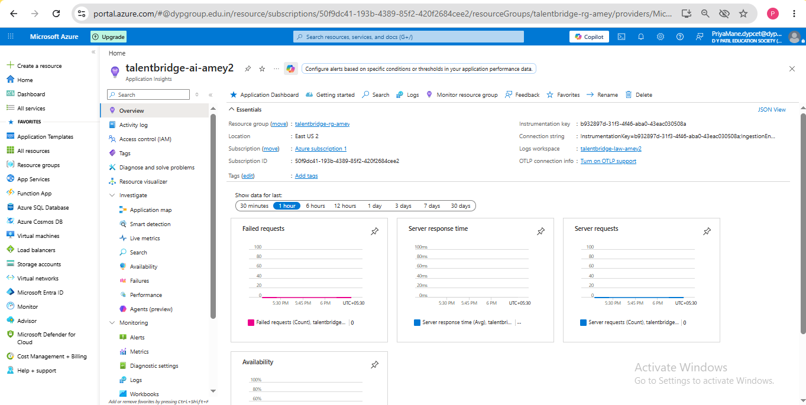
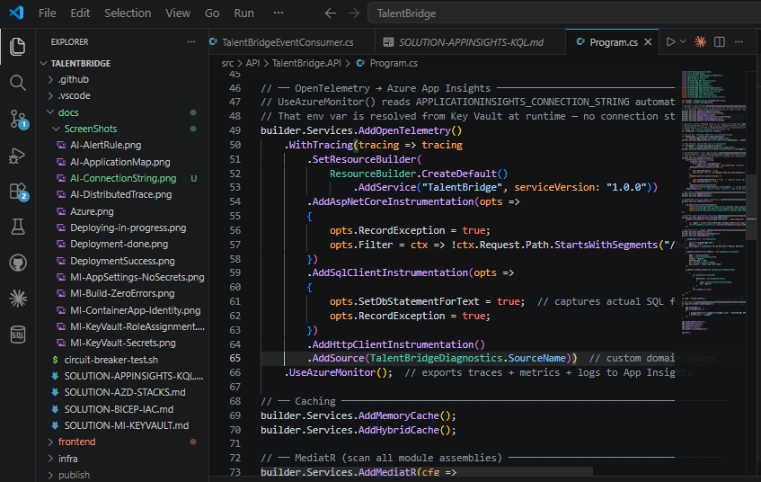
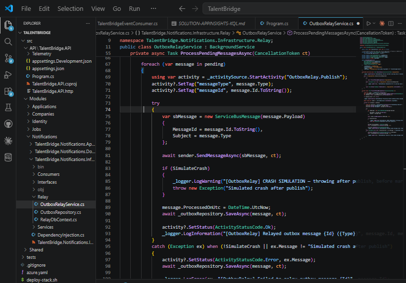
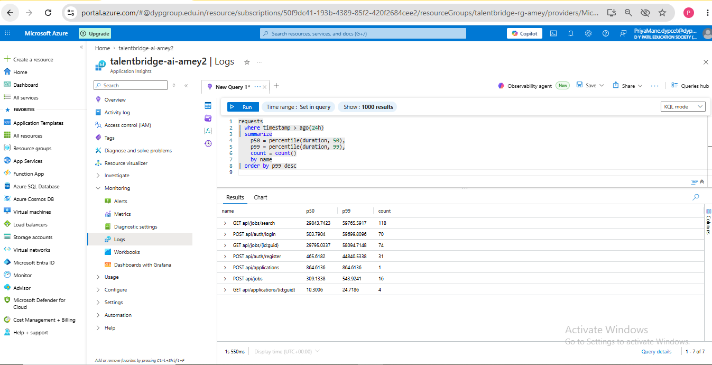
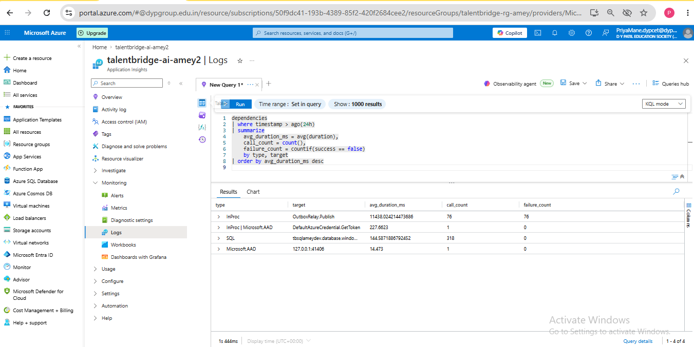
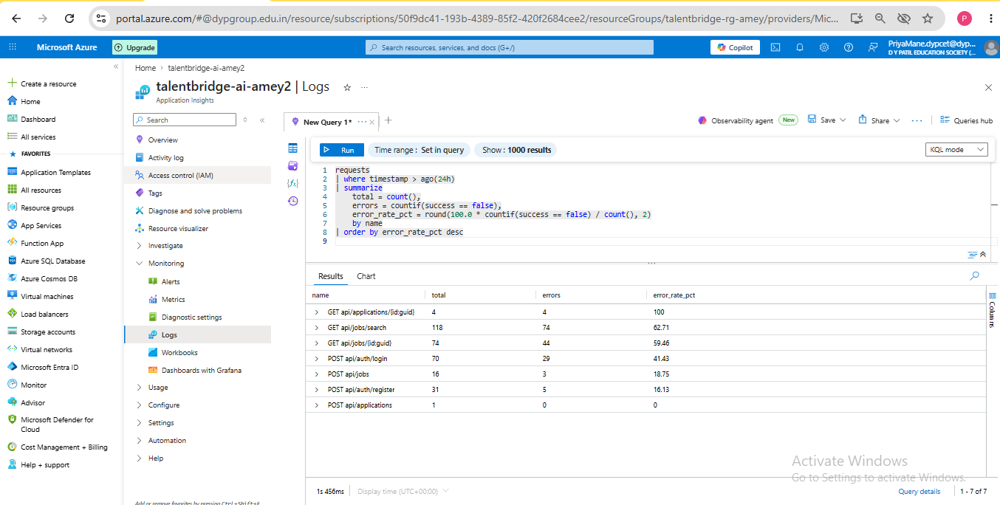
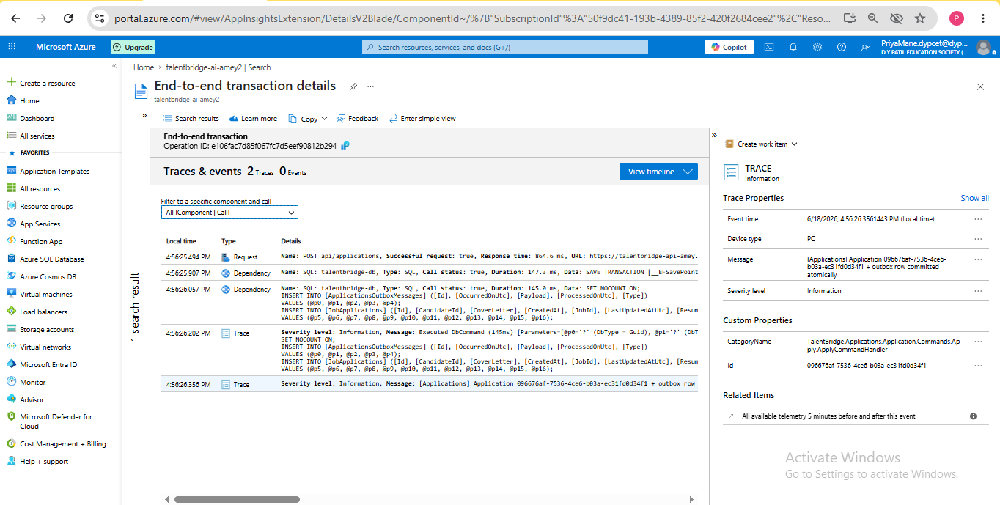
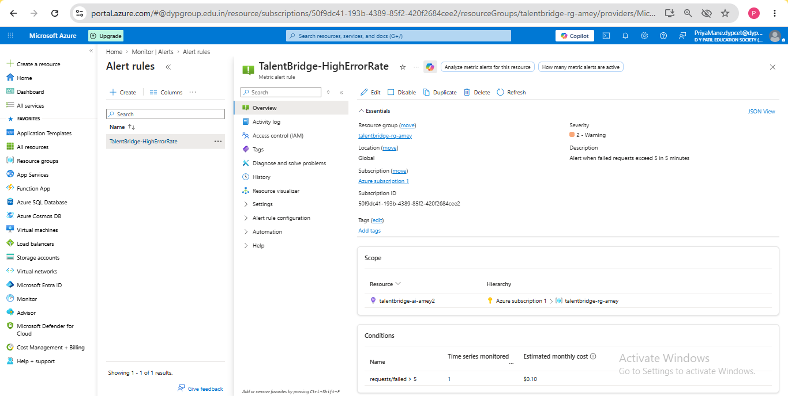

# TalentBridge — App Insights + KQL

## Task
Make production legible. Wire OpenTelemetry → App Insights, write KQL for p50/p99 by endpoint,
dependency call breakdown, and an alert on error rate. Confirm distributed tracing stitches
API → worker → DB.

---

## What was built

| Component | What it does |
|---|---|
| `Azure.Monitor.OpenTelemetry.AspNetCore` | All-in-one exporter: traces, metrics, logs → App Insights |
| `OpenTelemetry.Instrumentation.SqlClient` | Auto-captures every EF Core SQL query with duration |
| `OpenTelemetry.Instrumentation.Http` | Auto-captures outbound HTTP calls |
| `TalentBridgeDiagnostics.cs` | Custom `ActivitySource` for domain-level spans |
| `OutboxRelayService` + `StartActivity` | Stitches worker spans into the parent HTTP trace |

---

## Step 1 — App Insights connection string in Key Vault

Connection string stored as Key Vault secret `ApplicationInsights--ConnectionString`.
The `AddAzureMonitorTraceExporter()` reads `APPLICATIONINSIGHTS_CONNECTION_STRING`
from environment variables automatically — which is where the Key Vault reference resolves at runtime.
No connection string in appsettings.json.

### Screenshot — App Insights connection string


---

## Step 2 — OpenTelemetry wiring (Program.cs)

```csharp
builder.Services.AddOpenTelemetry()
    .WithTracing(tracing => tracing
        .SetResourceBuilder(
            ResourceBuilder.CreateDefault()
                .AddService("TalentBridge", serviceVersion: "1.0.0"))
        .AddAspNetCoreInstrumentation(opts =>
        {
            opts.RecordException = true;
            opts.Filter = ctx => !ctx.Request.Path.StartsWithSegments("/health");
        })
        .AddSqlClientInstrumentation(opts =>
        {
            opts.SetDbStatementForText = true;  // captures actual SQL for KQL queries
            opts.RecordException = true;
        })
        .AddHttpClientInstrumentation()
        .AddSource(TalentBridgeDiagnostics.SourceName))  // custom domain spans
    .UseAzureMonitor();  // exports traces + metrics + logs — reads APPLICATIONINSIGHTS_CONNECTION_STRING
```

`UseAzureMonitor()` is one call from `Azure.Monitor.OpenTelemetry.AspNetCore` that wires traces, metrics, and logs to App Insights. It replaces three separate exporter calls and reads `APPLICATIONINSIGHTS_CONNECTION_STRING` automatically from the environment — which is where the Key Vault reference resolves at runtime.

### Screenshot — Program.cs telemetry block


---

## Step 3 — Custom ActivitySource (TalentBridgeDiagnostics.cs)

```csharp
public static class TalentBridgeDiagnostics
{
    public const string SourceName = "TalentBridge.Application";
    public static readonly ActivitySource Source = new(SourceName, "1.0.0");
}
```

---

## Step 4 — OutboxRelayService instrumented

```csharp
using var activity = _activitySource.StartActivity("OutboxRelay.Publish");
activity?.SetTag("messageType", message.Type);
activity?.SetTag("messageId", message.Id.ToString());

await sender.SendMessageAsync(sbMessage, ct);

activity?.SetStatus(ActivityStatusCode.Ok);
```

This span becomes a child of the parent HTTP request span — making the full
API → worker → Service Bus chain visible in one distributed trace.

### Screenshot — OutboxRelayService showing StartActivity


---

## KQL Query 1 — p50 and p99 latency by endpoint

**Answers:** Which endpoints are slow at the tail (p99) even if they look fine at the median (p50)?

```kusto
requests
| where timestamp > ago(1h)
| where success == true
| summarize
    p50 = percentile(duration, 50),
    p99 = percentile(duration, 99),
    count = count()
    by name
| order by p99 desc
```

### Screenshot — p50/p99 query results


---

## KQL Query 2 — Dependency call breakdown (SQL + Service Bus)

**Answers:** Which downstream calls are taking the most time and which are failing?

```kusto
dependencies
| where timestamp > ago(1h)
| summarize
    avg_duration_ms = avg(duration),
    p99_ms = percentile(duration, 99),
    call_count = count(),
    failure_count = countif(success == false)
    by type, target
| order by avg_duration_ms desc
```

### Screenshot — Dependency breakdown results


---

## KQL Query 3 — Error rate by endpoint

**Answers:** Which endpoints are returning errors and how often?

```kusto
requests
| where timestamp > ago(1h)
| summarize
    total = count(),
    errors = countif(success == false),
    error_rate_pct = round(100.0 * countif(success == false) / count(), 2)
    by name
| where total > 5
| order by error_rate_pct desc
```

### Screenshot — Error rate results


---

## KQL Query 4 — Distributed trace: API → worker → DB stitched together

**Answers:** For a single request, what did the full execution path look like?
Shows HTTP request + SQL queries + OutboxRelay publish + Service Bus send — all linked by one operation ID.

```kusto
union requests, dependencies, traces
| where operation_Id == "PASTE_AN_OPERATION_ID_HERE"
| project timestamp, itemType, name, duration, success, operation_Id, operation_ParentId
| order by timestamp asc
```

To get an operation ID: App Insights → Transaction Search → click any request → copy Operation ID.

### Screenshot — Distributed trace waterfall


---

## Alert rule — Error rate spike

**Fires when:** error rate exceeds 5% over any 5-minute window with more than 10 requests.

```kusto
requests
| where timestamp > ago(5m)
| summarize
    total = count(),
    errors = countif(success == false)
| where total > 10
| extend error_rate = 100.0 * errors / total
| where error_rate > 5
```

**Settings:**
- Threshold: query returns any results
- Evaluation frequency: every 5 minutes
- Lookback period: 5 minutes
- Severity: 2 (Warning)

### Screenshot — Alert rule enabled


---

## What I learned

1. **OpenTelemetry is vendor-neutral instrumentation.** You instrument once with OTel and point
   the exporter at any backend. Switching from App Insights to Jaeger or Datadog means changing
   one line — not rewriting all your logging.

2. **`SetDbStatementForText = true` is essential.** Without it, SQL dependencies appear as
   `SELECT` with no context. With it, you see the full query in App Insights and can identify
   slow queries by name in KQL.

3. **p50 vs p99 tells a different story.** An endpoint can look fast at p50 (most requests are
   fine) but terrible at p99 (1 in 100 requests is very slow). p50 alone hides tail latency
   problems that affect real users.

4. **Distributed tracing needs custom spans to be useful.** Auto-instrumentation captures HTTP
   and SQL. But the gap between "HTTP request received" and "SQL query ran" is invisible without
   a custom `StartActivity("SubmitApplication")`. That span is what stitches the story together.

5. **Correlation IDs are automatic with OTel.** Every span carries `operation_Id` and
   `operation_ParentId`. This is what makes the waterfall view possible — no manual trace ID
   propagation needed.

---

## What would break this

- **`APPLICATIONINSIGHTS_CONNECTION_STRING` not set** — the exporter initialises but silently
  drops all telemetry. No error at startup. Everything looks fine locally but nothing appears
  in App Insights.

- **`AddSource("TalentBridge.Application")` missing from Program.cs** — custom spans from
  `TalentBridgeDiagnostics.Source.StartActivity(...)` are created but never exported. The
  distributed trace waterfall shows HTTP + SQL but the OutboxRelay span is missing — the chain
  looks broken.

- **`SetDbStatementForText = false` (default)** — SQL dependency entries appear in App Insights
  but with no query text. KQL Query 2 shows durations but you can't tell which query is slow.

- **Alert lookback too short** — if traffic is low (e.g. dev environment with 2 requests/min),
  the `total > 10` guard never triggers and the alert never fires even during 100% errors.

- **Sampling** — App Insights default sampling can drop traces at high volume. If sampling is
  too aggressive, distributed trace gaps appear (some spans dropped) and KQL counts under-count
  real requests.
