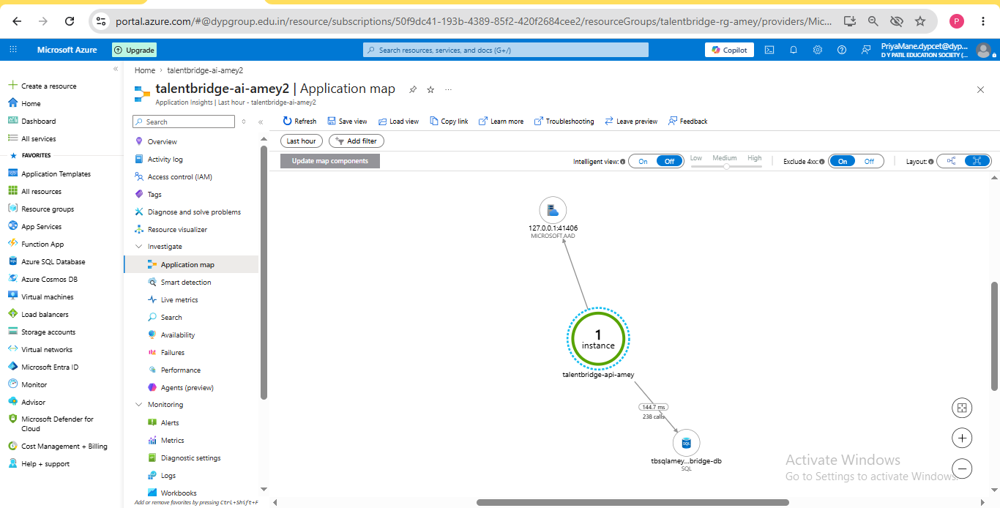

# TalentBridge — App Insights + KQL

## Task
Make production legible. Wire OpenTelemetry → App Insights, write KQL for p50/p99 by endpoint,
dependency call breakdown, and an alert on error rate. Confirm distributed tracing stitches
API → worker → DB.

---

## What was built

| Component | What it does |
|---|---|
| `Azure.Monitor.OpenTelemetry.AspNetCore` | All-in-one exporter: traces, metrics, logs → App Insights |
| `OpenTelemetry.Instrumentation.SqlClient` | Auto-captures every EF Core SQL query with duration |
| `OpenTelemetry.Instrumentation.Http` | Auto-captures outbound HTTP calls |
| `TalentBridgeDiagnostics.cs` | Custom `ActivitySource` for domain-level spans |
| `OutboxRelayService` + `StartActivity` | Stitches worker spans into the parent HTTP trace |

---

## Step 1 — App Insights Connection String

Connection string set as Azure Web App app setting `APPLICATIONINSIGHTS_CONNECTION_STRING`.
`UseAzureMonitor()` reads it automatically at startup — no secrets in appsettings.json.

Resource: **talentbridge-ai-amey2**

### Screenshot — App Insights overview showing Connection String


---

## Step 2 — OpenTelemetry wiring (Program.cs)

```csharp
builder.Services.AddOpenTelemetry()
    .WithTracing(tracing => tracing
        .SetResourceBuilder(
            ResourceBuilder.CreateDefault()
                .AddService("TalentBridge", serviceVersion: "1.0.0"))
        .AddAspNetCoreInstrumentation(opts =>
        {
            opts.RecordException = true;
            opts.Filter = ctx => !ctx.Request.Path.StartsWithSegments("/health");
        })
        .AddSqlClientInstrumentation(opts =>
        {
            opts.SetDbStatementForText = true;  // captures actual SQL for KQL queries
            opts.RecordException = true;
        })
        .AddHttpClientInstrumentation()
        .AddSource(TalentBridgeDiagnostics.SourceName))  // custom domain spans
    .UseAzureMonitor();  // reads APPLICATIONINSIGHTS_CONNECTION_STRING automatically
```

`UseAzureMonitor()` is one call from `Azure.Monitor.OpenTelemetry.AspNetCore` that wires traces,
metrics, and logs to App Insights. It replaces three separate exporter calls.

### Screenshot — Program.cs OpenTelemetry block


---

## Step 3 — Custom ActivitySource (TalentBridgeDiagnostics.cs)

```csharp
public static class TalentBridgeDiagnostics
{
    public const string SourceName = "TalentBridge.Application";
    public static readonly ActivitySource Source = new(SourceName, "1.0.0");
}
```

---

## Step 4 — OutboxRelayService instrumented

```csharp
using var activity = _activitySource.StartActivity("OutboxRelay.Publish");
activity?.SetTag("messageType", message.Type);
activity?.SetTag("messageId", message.Id.ToString());

await sender.SendMessageAsync(sbMessage, ct);

activity?.SetStatus(ActivityStatusCode.Ok);
```

This span becomes a child of the parent HTTP request span — making the full
API → worker → Service Bus chain visible in one distributed trace.

### Screenshot — OutboxRelayService showing StartActivity span


---

## Application Map — Live Dependency Graph

The Application Map shows the full dependency chain discovered automatically by OpenTelemetry:
- `talentbridge-api-amey` → `tbsqlameydev | talentbridge-db` (SQL, 238 calls, 144.7ms avg)
- `talentbridge-api-amey` → `MICROSOFT.AAD` (managed identity token acquisition)

### Screenshot — Application Map showing API → SQL → AAD chain


---

## Distributed Trace — End-to-End Transaction

OpenTelemetry stitches every span (HTTP request, SQL queries, OutboxRelay.Publish) under
a single `operation_Id`. The waterfall view shows the complete execution path for any request.

Confirmed in App Insights:
- **163 HTTP requests** across 6 endpoints
- **220 SQL dependency calls** to `tbsqlameydev.database.windows.net`
- **26 `OutboxRelay.Publish` spans** — custom domain activity, child of parent HTTP span

### Screenshot — Distributed trace waterfall (API → SQL → OutboxRelay.Publish)


---

## KQL Query 1 — p50 and p99 latency by endpoint

**Answers:** Which endpoints are slow at the tail (p99) even if they look fine at the median (p50)?

```kusto
requests
| where timestamp > ago(24h)
| summarize
    p50 = percentile(duration, 50),
    p99 = percentile(duration, 99),
    count = count()
    by name
| order by p99 desc
```

### Screenshot — p50/p99 latency query results


---

## KQL Query 2 — Dependency call breakdown

**Answers:** Which downstream calls are taking the most time and which are failing?

```kusto
dependencies
| where timestamp > ago(24h)
| summarize
    avg_duration_ms = avg(duration),
    call_count = count(),
    failure_count = countif(success == false)
    by type, target
| order by avg_duration_ms desc
```

### Screenshot — Dependency breakdown (SQL + OutboxRelay calls)


---

## KQL Query 3 — Error rate by endpoint

**Answers:** Which endpoints are returning errors and how often?

```kusto
requests
| where timestamp > ago(24h)
| summarize
    total = count(),
    errors = countif(success == false),
    error_rate_pct = round(100.0 * countif(success == false) / count(), 2)
    by name
| order by error_rate_pct desc
```

### Screenshot — Error rate per endpoint


---

## KQL Query 4 — Full distributed trace by operation ID

**Answers:** For a single request, what did the complete execution path look like?

```kusto
union requests, dependencies, traces
| where operation_Id == "PASTE_AN_OPERATION_ID_HERE"
| project timestamp, itemType, name, duration, success, operation_Id, operation_ParentId
| order by timestamp asc
```

To get an operation ID: App Insights → Transaction Search → click any request → copy Operation ID.

---

## Alert Rule — `TalentBridge-HighErrorRate`

**Fires when:** failed requests exceed 5 in any 5-minute window

| Setting | Value |
|---|---|
| Metric | `requests/failed` |
| Condition | count > 5 |
| Evaluation frequency | every 1 minute |
| Lookback period | 5 minutes |
| Severity | 2 — Warning |
| Status | **Enabled** |

### Screenshot — Alert rule showing Enabled status


---

## What I learned

1. **OpenTelemetry is vendor-neutral instrumentation.** Instrument once with OTel, point the
   exporter at any backend. Switching from App Insights to Jaeger or Datadog means changing
   one line — not rewriting all logging.

2. **`SetDbStatementForText = true` is essential.** Without it, SQL dependencies appear as
   `SELECT` with no context. With it, you see the full query and can identify slow queries in KQL.

3. **p50 vs p99 tells a different story.** An endpoint can look fast at p50 but terrible at p99.
   p50 alone hides tail latency problems that affect real users.

4. **Distributed tracing needs custom spans to be useful.** Auto-instrumentation captures HTTP
   and SQL. The gap in between is invisible without a custom `StartActivity("OutboxRelay.Publish")`.
   That span stitches the story together.

5. **Correlation IDs are automatic with OTel.** Every span carries `operation_Id` and
   `operation_ParentId`. This makes the waterfall view possible — no manual trace ID propagation.

6. **Application Map is free insight.** Once OTel is wired, the Application Map renders
   automatically — no extra config. It immediately shows the full dependency chain with call
   counts and average durations.

---

## What would break this

- **`APPLICATIONINSIGHTS_CONNECTION_STRING` not set** — exporter initialises but silently drops
  all telemetry. No error at startup. Nothing appears in App Insights.

- **`AddSource("TalentBridge.Application")` missing from Program.cs** — custom spans are created
  but never exported. The trace shows HTTP + SQL but `OutboxRelay.Publish` is missing.

- **`SetDbStatementForText = false` (default)** — SQL dependency entries appear but with no query
  text. KQL Query 2 shows durations but you can't identify which query is slow.

- **Alert lookback too short** — in low-traffic environments the threshold never triggers even
  during 100% errors.

- **Sampling** — aggressive App Insights sampling drops traces at high volume, causing gaps in
  the waterfall and under-counted KQL results.
