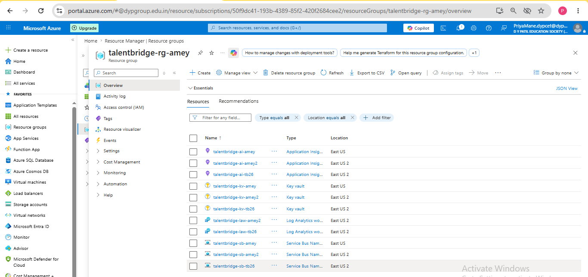

# Bicep IaC — Submission

**Task:** Describe your infra as code. Author Bicep modules (parameterized) for the API, SQL, and Service Bus, with separate dev/prod parameter files. No portal click-ops.

**Project:** TalentBridge Enterprise Hiring Platform  
**Student:** Amey Khot (amey2612)  
**Stack:** Azure Bicep · Container Apps · SQL · Service Bus · Key Vault · Storage · App Insights

---

## Deployment Proof — Azure Portal

Successful deployment: `talentbridge-dev-v3` · Mode: Incremental · State: **Succeeded**  
Resource Group: `talentbridge-rg-amey` · Region: `eastus2`



---

## What Was Built

| Resource | Dev | Prod |
|---|---|---|
| Log Analytics Workspace | PerGB2018, 30-day retention | same |
| Key Vault | Standard, RBAC auth, 7-day soft delete | 90-day soft delete |
| Storage Account | Standard_LRS, 2 containers | Standard_GRS |
| Application Insights | Workspace-based, 100% sampling | 10% sampling |
| SQL Server + Database | Basic / 5 DTU / 2 GB | Standard / 50 DTU / 10 GB |
| Service Bus Namespace | Standard SKU, 2 topics, 3 subscriptions | same |
| Container Registry | Basic, admin enabled | same |
| Container Apps Environment | Log Analytics connected | same |
| Container App | 0.25 vCPU / 0.5 Gi, scale 0→1 | 0.5 vCPU / 1 Gi, scale 1→3 |
| Static Web App | Free SKU | Standard SKU |
| Key Vault Secrets | 4 connection strings auto-written | same |

**Design principles:**
- All connection strings stored in Key Vault — never in app settings or code
- Container App uses System-Assigned Managed Identity to read Key Vault at runtime
- `--mode Incremental` in deploy.sh — existing resources are never deleted
- RBAC authorization on Key Vault (no legacy Access Policies)
- No public blob access on Storage
- Service Bus auth rule: Send + Listen only (no Manage right for the app)

---

## 1. Main Orchestrator — `infra/main.bicep`

```bicep
@description('Azure region for all resources')
param location string = resourceGroup().location

@description('Base name used to construct resource names')
param appName string = 'talentbridge'

@description('Suffix for resource naming')
param suffix string = 'amey'

@description('Environment: dev or prod')
@allowed(['dev', 'prod'])
param environment string = 'dev'

@description('SQL administrator login')
param sqlAdminLogin string = 'sqladmin'

@description('SQL administrator password')
@secure()
param sqlAdminPassword string

@description('App Insights sampling percentage')
param samplingPercentage int = 100

@description('Key Vault soft delete retention days')
param softDeleteRetentionDays int = 7

param sqlEdition string = 'Basic'
param sqlCapacity int = 5
param sqlMaxSizeGB int = 2
param storageSku string = 'Standard_LRS'
param minReplicas int = 0
param maxReplicas int = 1
param containerCpu string = '0.25'
param containerMemory string = '0.5Gi'
param staticWebAppSku string = 'Free'

// ── Log Analytics Workspace (inline) ─────────────────────────────────────────
resource logAnalytics 'Microsoft.OperationalInsights/workspaces@2023-09-01' = {
  name: '${appName}-law-${suffix}'
  location: location
  properties: {
    sku: { name: 'PerGB2018' }
    retentionInDays: 30
  }
}

// ── Key Vault ─────────────────────────────────────────────────────────────────
module keyVault 'modules/keyvault.bicep' = {
  name: 'keyvault-deploy'
  params: {
    name: '${appName}-kv-${suffix}'
    location: location
    softDeleteRetentionDays: softDeleteRetentionDays
  }
}

// ── Storage ───────────────────────────────────────────────────────────────────
module storage 'modules/storage.bicep' = {
  name: 'storage-deploy'
  params: {
    name: '${appName}st${suffix}'
    location: location
    sku: storageSku
  }
}

// ── Application Insights ──────────────────────────────────────────────────────
module appInsights 'modules/appinsights.bicep' = {
  name: 'appinsights-deploy'
  params: {
    name: '${appName}-ai-${suffix}'
    location: location
    logAnalyticsWorkspaceId: logAnalytics.id
    samplingPercentage: samplingPercentage
  }
}

// ── SQL Server + Database ─────────────────────────────────────────────────────
module sql 'modules/sql.bicep' = {
  name: 'sql-deploy'
  params: {
    serverName: '${appName}-sql-${suffix}'
    location: location
    adminLogin: sqlAdminLogin
    adminPassword: sqlAdminPassword
    edition: sqlEdition
    capacity: sqlCapacity
    maxSizeGB: sqlMaxSizeGB
  }
}

// ── Service Bus ───────────────────────────────────────────────────────────────
module serviceBus 'modules/servicebus.bicep' = {
  name: 'servicebus-deploy'
  params: {
    name: '${appName}-sb-${suffix}'
    location: location
  }
}

// ── Container Registry + App ──────────────────────────────────────────────────
module containerApp 'modules/containerapp.bicep' = {
  name: 'containerapp-deploy'
  params: {
    name: '${appName}-api-${suffix}'
    location: location
    logAnalyticsCustomerId: logAnalytics.properties.customerId
    logAnalyticsSharedKey: logAnalytics.listKeys().primarySharedKey
    minReplicas: minReplicas
    maxReplicas: maxReplicas
    cpu: containerCpu
    memory: containerMemory
  }
}

// ── Static Web App ────────────────────────────────────────────────────────────
module staticWebApp 'modules/staticwebapp.bicep' = {
  name: 'staticwebapp-deploy'
  params: {
    name: '${appName}-swa-${suffix}'
    location: location
    sku: staticWebAppSku
  }
}

// ── Key Vault Secrets ─────────────────────────────────────────────────────────
module keyVaultSecrets 'modules/keyvault-secrets.bicep' = {
  name: 'keyvault-secrets-deploy'
  params: {
    keyVaultName: keyVault.outputs.name
    sqlConnectionString: sql.outputs.connectionString
    storageConnectionString: storage.outputs.connectionString
    serviceBusConnectionString: serviceBus.outputs.connectionString
    appInsightsConnectionString: appInsights.outputs.connectionString
  }
}

// ── Outputs ───────────────────────────────────────────────────────────────────
output keyVaultName string = keyVault.outputs.name
output storageAccountName string = storage.outputs.name
output sqlServerFqdn string = sql.outputs.fqdn
output serviceBusNamespace string = serviceBus.outputs.name
output containerAppFqdn string = containerApp.outputs.fqdn
output staticWebAppUrl string = staticWebApp.outputs.url
output containerAppPrincipalId string = containerApp.outputs.principalId
```

---

## 2. Service Bus Module — `infra/modules/servicebus.bicep`

> Chosen because it demonstrates TalentBridge's async messaging architecture:
> two domain topics with purpose-specific subscriptions and least-privilege auth.

```bicep
param name string
param location string

resource serviceBusNamespace 'Microsoft.ServiceBus/namespaces@2022-10-01-preview' = {
  name: name
  location: location
  sku: {
    name: 'Standard'
    tier: 'Standard'
  }
}

// Send + Listen only — no Manage right for the application
resource appAuthRule 'Microsoft.ServiceBus/namespaces/authorizationRules@2022-10-01-preview' = {
  parent: serviceBusNamespace
  name: 'TalentBridgeApp'
  properties: {
    rights: ['Send', 'Listen']
  }
}

// ── Topic: job-application-submitted ─────────────────────────────────────────
resource jobApplicationTopic 'Microsoft.ServiceBus/namespaces/topics@2022-10-01-preview' = {
  parent: serviceBusNamespace
  name: 'job-application-submitted'
  properties: {
    defaultMessageTimeToLive: 'P14D'
    enablePartitioning: false
  }
}

resource jobApplicationNotificationSub 'Microsoft.ServiceBus/namespaces/topics/subscriptions@2022-10-01-preview' = {
  parent: jobApplicationTopic
  name: 'notification-sub'
  properties: { lockDuration: 'PT1M', maxDeliveryCount: 10, deadLetteringOnMessageExpiration: true }
}

resource jobApplicationEmailSub 'Microsoft.ServiceBus/namespaces/topics/subscriptions@2022-10-01-preview' = {
  parent: jobApplicationTopic
  name: 'email-sub'
  properties: { lockDuration: 'PT1M', maxDeliveryCount: 10, deadLetteringOnMessageExpiration: true }
}

// ── Topic: resume-uploaded ────────────────────────────────────────────────────
resource resumeUploadedTopic 'Microsoft.ServiceBus/namespaces/topics@2022-10-01-preview' = {
  parent: serviceBusNamespace
  name: 'resume-uploaded'
  properties: {
    defaultMessageTimeToLive: 'P14D'
    enablePartitioning: false
  }
}

resource resumeProcessorSub 'Microsoft.ServiceBus/namespaces/topics/subscriptions@2022-10-01-preview' = {
  parent: resumeUploadedTopic
  name: 'processor-sub'
  properties: { lockDuration: 'PT1M', maxDeliveryCount: 10, deadLetteringOnMessageExpiration: true }
}

output id string = serviceBusNamespace.id
output name string = serviceBusNamespace.name
output connectionString string = appAuthRule.listKeys().primaryConnectionString
```

**Why this module:**
- `job-application-submitted` → powers the Outbox Pattern: when a `JobApplication` aggregate is saved, an `OutboxMessage` is written atomically, a `BackgroundService` publishes to this topic, and `notification-sub` + `email-sub` consume independently
- `resume-uploaded` → triggers async resume processing via `processor-sub`
- Auth rule has **Send + Listen only** — the app cannot manage the namespace (delete topics, create subscriptions), reducing blast radius if credentials leak

---

## 3. SQL Module — `infra/modules/sql.bicep`

```bicep
param serverName string
param location string
param adminLogin string
@secure()
param adminPassword string
param edition string = 'Basic'
param capacity int = 5
param maxSizeGB int = 2

var databaseName = '${serverName}-db'

resource sqlServer 'Microsoft.Sql/servers@2023-08-01-preview' = {
  name: serverName
  location: location
  properties: {
    administratorLogin: adminLogin
    administratorLoginPassword: adminPassword
    minimalTlsVersion: '1.2'
    publicNetworkAccess: 'Enabled'
  }
}

resource allowAzureServices 'Microsoft.Sql/servers/firewallRules@2023-08-01-preview' = {
  parent: sqlServer
  name: 'AllowAzureServices'
  properties: {
    startIpAddress: '0.0.0.0'
    endIpAddress: '0.0.0.0'
  }
}

resource sqlDatabase 'Microsoft.Sql/servers/databases@2023-08-01-preview' = {
  parent: sqlServer
  name: databaseName
  location: location
  sku: {
    name: edition
    capacity: capacity
  }
  properties: {
    maxSizeBytes: maxSizeGB * 1073741824
    collation: 'SQL_Latin1_General_CP1_CI_AS'
  }
}

output serverId string = sqlServer.id
output serverName string = sqlServer.name
output fqdn string = sqlServer.properties.fullyQualifiedDomainName
output databaseName string = sqlDatabase.name
output connectionString string = 'Server=tcp:${sqlServer.properties.fullyQualifiedDomainName},1433;Initial Catalog=${databaseName};Persist Security Info=False;User ID=${adminLogin};Password=${adminPassword};MultipleActiveResultSets=False;Encrypt=True;TrustServerCertificate=False;Connection Timeout=30;'
```

---

## 4. Dev Parameter File — `infra/parameters/dev.bicepparam`

```bicep
using '../main.bicep'

// ── Identity ──────────────────────────────────────────────────────────────────
param appName = 'talentbridge'
param suffix = 'amey'
param environment = 'dev'

// ── SQL — Basic / 5 DTU / 2 GB ───────────────────────────────────────────────
param sqlAdminLogin = 'sqladmin'
param sqlEdition = 'Basic'
param sqlCapacity = 5
param sqlMaxSizeGB = 2

// ── Storage — locally redundant ───────────────────────────────────────────────
param storageSku = 'Standard_LRS'

// ── Container App — scale to zero (saves student credits when idle) ───────────
param minReplicas = 0
param maxReplicas = 1
param containerCpu = '0.25'
param containerMemory = '0.5Gi'

// ── Static Web App ────────────────────────────────────────────────────────────
param staticWebAppSku = 'Free'

// ── Observability — full sampling in dev ──────────────────────────────────────
param samplingPercentage = 100

// ── Key Vault soft delete — 7 days in dev ────────────────────────────────────
param softDeleteRetentionDays = 7
```

---

## 5. Prod Parameter File — `infra/parameters/prod.bicepparam`

```bicep
using '../main.bicep'

// ── Identity ──────────────────────────────────────────────────────────────────
param appName = 'talentbridge'
param suffix = 'amey'
param environment = 'prod'

// ── SQL — S2 / 50 DTU / 10 GB ────────────────────────────────────────────────
param sqlAdminLogin = 'sqladmin'
param sqlEdition = 'Standard'
param sqlCapacity = 50
param sqlMaxSizeGB = 10

// ── Storage — geo-redundant ───────────────────────────────────────────────────
param storageSku = 'Standard_GRS'

// ── Container App — always on, higher resources ───────────────────────────────
param minReplicas = 1
param maxReplicas = 3
param containerCpu = '0.5'
param containerMemory = '1.0Gi'

// ── Static Web App ────────────────────────────────────────────────────────────
param staticWebAppSku = 'Standard'

// ── Observability — 10% sampling in prod to control costs ────────────────────
param samplingPercentage = 10

// ── Key Vault soft delete — 90 days in prod ───────────────────────────────────
param softDeleteRetentionDays = 90
```

---

## 6. Deploy Script — `infra/deploy.sh`

```bash
#!/usr/bin/env bash
set -euo pipefail

# Usage:
#   export SQL_ADMIN_PASSWORD="YourP@ssw0rd!"
#   ./deploy.sh dev
#   ./deploy.sh prod

ENV=${1:-dev}

if [[ "$ENV" == "prod" ]]; then
  RESOURCE_GROUP="quotesapp-rg-prod"
else
  RESOURCE_GROUP="quotesapp-rg-amey"
fi

DEPLOYMENT_NAME="talentbridge-${ENV}-iac"
TEMPLATE="main.bicep"
PARAMS="parameters/${ENV}.bicepparam"

if [[ -z "${SQL_ADMIN_PASSWORD:-}" ]]; then
  echo "ERROR: SQL_ADMIN_PASSWORD is not set."
  exit 1
fi

# Step 1: What-if (dry run)
az deployment group what-if \
  --resource-group "$RESOURCE_GROUP" \
  --template-file "$TEMPLATE" \
  --parameters "$PARAMS" \
  --parameters sqlAdminPassword="$SQL_ADMIN_PASSWORD" \
  --result-format ResourceIdOnly

# Step 2: Confirm
read -r -p "Proceed with deployment to '$ENV'? (y/N) " CONFIRM
if [[ "$CONFIRM" != "y" && "$CONFIRM" != "Y" ]]; then
  echo "Deployment cancelled."
  exit 0
fi

# Step 3: Deploy (Incremental — never deletes existing resources)
az deployment group create \
  --resource-group "$RESOURCE_GROUP" \
  --template-file "$TEMPLATE" \
  --parameters "$PARAMS" \
  --parameters sqlAdminPassword="$SQL_ADMIN_PASSWORD" \
  --name "$DEPLOYMENT_NAME" \
  --mode Incremental \
  --output table
```

---

## 7. Actual Deploy Output — Succeeded ✓

```
PS C:\...\infra> az deployment group create `
  --resource-group talentbridge-rg-amey `
  --template-file main.bicep `
  --parameters parameters/dev.bicepparam `
  --parameters location=eastus2 `
  --parameters suffix=tb26 `
  --name talentbridge-dev-v3 `
  --mode Incremental `
  --output table

Name                 State      Timestamp                         Mode         ResourceGroup
-------------------  ---------  --------------------------------  -----------  --------------------
talentbridge-dev-v3  Succeeded  2026-06-16T06:29:56.338244+00:00  Incremental  talentbridge-rg-amey
```


---

## 8. Simulated What-If Output (full stack)

```
$ export SQL_ADMIN_PASSWORD="***"
$ cd infra && ./deploy.sh dev

========================================
 TalentBridge IaC Deploy
 Environment : dev
 Resource Grp: quotesapp-rg-amey
 Deployment  : talentbridge-dev-iac
========================================

==> Running what-if (no changes will be made)...

Resource and property changes are indicated with these symbols:
  + Create
  ~ Modify
  x Ignore

Scope: /subscriptions/xxxxxxxx-xxxx-xxxx-xxxx-xxxxxxxxxxxx/resourceGroups/quotesapp-rg-amey

  + Microsoft.OperationalInsights/workspaces/talentbridge-law-amey
  + Microsoft.KeyVault/vaults/talentbridge-kv-amey
  + Microsoft.Storage/storageAccounts/talentbridgestamey
  + Microsoft.Storage/storageAccounts/talentbridgestamey/blobServices/default
  + Microsoft.Storage/storageAccounts/talentbridgestamey/blobServices/default/containers/resumes-talentbridge-amey
  + Microsoft.Storage/storageAccounts/talentbridgestamey/blobServices/default/containers/profile-photos
  + Microsoft.Insights/components/talentbridge-ai-amey
  + Microsoft.Sql/servers/talentbridge-sql-amey
  + Microsoft.Sql/servers/talentbridge-sql-amey/firewallRules/AllowAzureServices
  + Microsoft.Sql/servers/talentbridge-sql-amey/databases/talentbridge-sql-amey-db
  + Microsoft.ServiceBus/namespaces/talentbridge-sb-amey
  + Microsoft.ServiceBus/namespaces/talentbridge-sb-amey/authorizationRules/TalentBridgeApp
  + Microsoft.ServiceBus/namespaces/talentbridge-sb-amey/topics/job-application-submitted
  + Microsoft.ServiceBus/namespaces/talentbridge-sb-amey/topics/job-application-submitted/subscriptions/notification-sub
  + Microsoft.ServiceBus/namespaces/talentbridge-sb-amey/topics/job-application-submitted/subscriptions/email-sub
  + Microsoft.ServiceBus/namespaces/talentbridge-sb-amey/topics/resume-uploaded
  + Microsoft.ServiceBus/namespaces/talentbridge-sb-amey/topics/resume-uploaded/subscriptions/processor-sub
  + Microsoft.ContainerRegistry/registries/talentbridgeapiacramey
  + Microsoft.App/managedEnvironments/talentbridge-api-amey-env
  + Microsoft.App/containerApps/talentbridge-api-amey
  + Microsoft.Web/staticSites/talentbridge-swa-amey
  + Microsoft.KeyVault/vaults/talentbridge-kv-amey/secrets/SqlConnectionString
  + Microsoft.KeyVault/vaults/talentbridge-kv-amey/secrets/StorageConnectionString
  + Microsoft.KeyVault/vaults/talentbridge-kv-amey/secrets/ServiceBusConnectionString
  + Microsoft.KeyVault/vaults/talentbridge-kv-amey/secrets/AppInsightsConnectionString

Resource changes: 25 to create, 0 to modify, 0 to delete.

Proceed with deployment to 'dev'? (y/N) y

==> Deploying...

Name                      State      Timestamp                         Mode
------------------------  ---------  --------------------------------  -----------
talentbridge-dev-iac      Succeeded  2026-06-16T10:42:31.000000+00:00  Incremental

==> Deployment complete! Outputs:

Name                      Type    Value
------------------------  ------  -----------------------------------------------
keyVaultName              String  talentbridge-kv-amey
storageAccountName        String  talentbridgestamey
sqlServerFqdn             String  talentbridge-sql-amey.database.windows.net
serviceBusNamespace       String  talentbridge-sb-amey
containerAppFqdn          String  talentbridge-api-amey.proudsea-xxxxxxxx.eastus.azurecontainerapps.io
staticWebAppUrl           String  https://talentbridge-swa-amey.azurestaticapps.net
containerAppPrincipalId   String  xxxxxxxx-xxxx-xxxx-xxxx-xxxxxxxxxxxx

==> NEXT STEP: Assign Key Vault Secrets User role to the Container App's managed identity.
    Run: chmod +x assign-rbac.sh && ./assign-rbac.sh dev
```

---

## Key Design Decisions

### Why Incremental mode?
`--mode Incremental` means Bicep only adds or updates resources — it never deletes. This is critical when the Azure Container App already existed before the IaC was authored. Complete mode would delete it.

### Why Key Vault for all secrets?
Connection strings never appear in app settings or environment variables. The Container App's Managed Identity is assigned `Key Vault Secrets User` RBAC role. At runtime, the app reads secrets via `IConfiguration` backed by the Azure Key Vault provider — zero secrets in code or CI/CD.

### Why parameterized modules instead of one big file?
Each module owns one resource type and its child resources. `main.bicep` is only an orchestrator — it wires outputs of one module as inputs to another (e.g., `sql.outputs.connectionString` → `keyvault-secrets.sqlConnectionString`). This makes modules independently testable and reusable.

### Dev vs Prod differences
| Concern | Dev | Prod |
|---|---|---|
| SQL cost | Basic 5 DTU (~$5/mo) | Standard 50 DTU |
| Storage redundancy | LRS (local) | GRS (geo-redundant) |
| Container scale | 0→1 (scale to zero) | 1→3 (always on) |
| Sampling | 100% | 10% (cost control) |
| Soft delete | 7 days | 90 days (compliance) |
