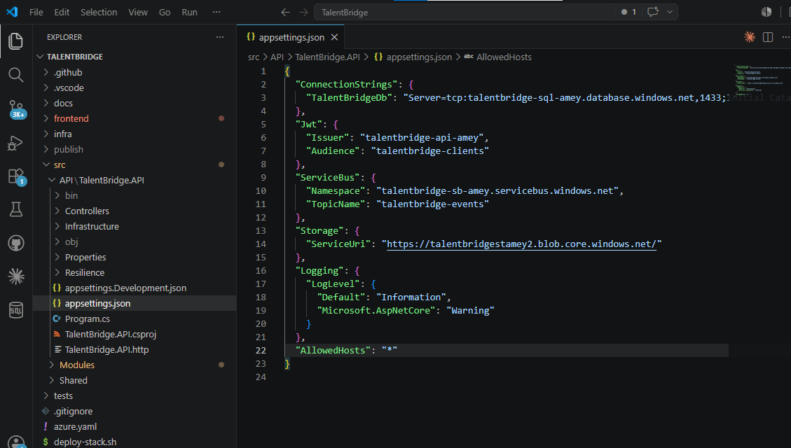
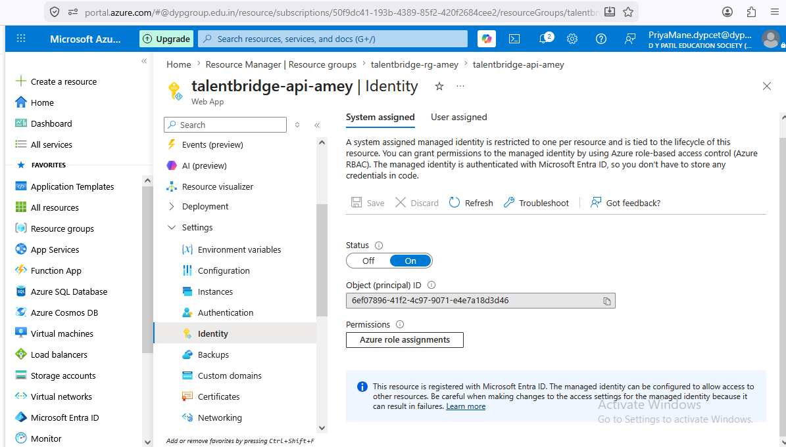
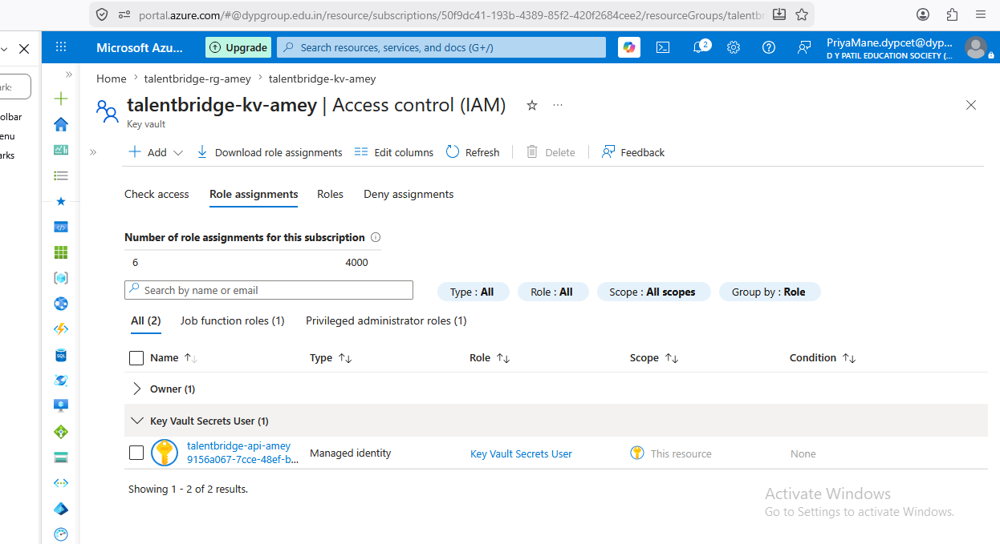
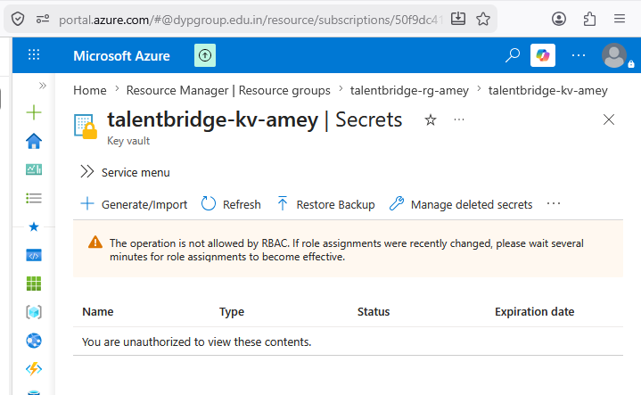
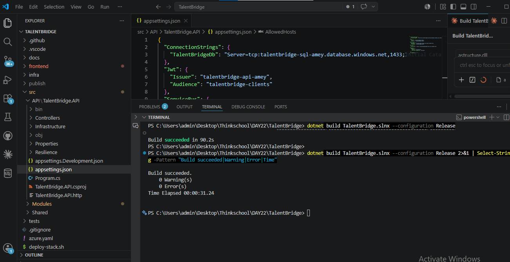

# TalentBridge — Identity End-to-End: Managed Identity + Key Vault

## Task
Remove all secrets from the app. Use Managed Identity for API→SQL and API→Service Bus paths,
Entra ID for app auth, and Key Vault references for any remaining config.
Prove there are zero secrets in app settings.

---

## What changed and why

### 1. API → SQL (Managed Identity)

**Before:**
```
"TalentBridgeDb": "Server=tcp:...;User ID=sqladmin;Password=SuperSecret123!;"
```

**After:**
```
"TalentBridgeDb": "Server=tcp:talentbridge-sql-amey.database.windows.net,1433;Initial Catalog=talentbridge-sql-amey-db;Authentication=Active Directory Default;Encrypt=True;TrustServerCertificate=False;Connection Timeout=30;"
```

`Authentication=Active Directory Default` tells the SQL driver to call `DefaultAzureCredential`
instead of reading a username/password. Locally that resolves via `az login`. In Azure it
resolves to the Container App's system-assigned Managed Identity. No password in code or config.

EF Core picks up this connection string from `Configuration["ConnectionStrings:TalentBridgeDb"]`
in each module's `DependencyInjection.cs` — no code change needed there.

---

### 2. API → Service Bus (Managed Identity)

**Before:**
```csharp
new ServiceBusClient("Endpoint=sb://...;SharedAccessKeyName=...;SharedAccessKey=AAAA...")
```

**After:**
```csharp
var credential = new DefaultAzureCredential();
new ServiceBusClient("talentbridge-sb-amey.servicebus.windows.net", credential)
```

The namespace FQDN is all that's needed. `DefaultAzureCredential` gets an OAuth token from
Entra ID at runtime. The `Azure Service Bus Data Owner` RBAC role on the namespace is what
authorises it — assigned in `containerapp.bicep`.

---

### 3. API → Blob Storage (Managed Identity)

**Before:**
```csharp
new BlobServiceClient("DefaultEndpointsProtocol=https;AccountName=...;AccountKey=AAAA...")
```

**After:**
```csharp
new BlobServiceClient(new Uri("https://talentbridgestamey2.blob.core.windows.net/"), credential)
```

Same pattern — URI + DefaultAzureCredential, no account key.

---

### 4. JWT Secret → Key Vault reference

The JWT signing key is sensitive and cannot use Managed Identity (it's a symmetric secret,
not an Azure resource). It lives in Key Vault and is surfaced to the Container App via a
Key Vault secret reference — no plaintext in any config file.

**Key Vault reference syntax (Container App secret):**
```bicep
secrets: [
  {
    name: 'jwt-secret'
    keyVaultUrl: 'https://talentbridge-kv-amey.vault.azure.net/secrets/JwtSecret'
    identity: 'system'   // use the Container App's system-assigned MI to read it
  }
]
```

The secret is then injected into the container as an environment variable:
```bicep
env: [
  {
    name: 'Jwt__Secret'
    secretRef: 'jwt-secret'
  }
]
```

The `@Microsoft.KeyVault(SecretUri=https://talentbridge-kv-amey.vault.azure.net/secrets/JwtSecret/)` 
syntax is the App Service equivalent. Both resolve the secret at runtime from Key Vault —
the value never appears in app settings or source control.

---

### 5. RBAC role assignments (containerapp.bicep)

Three role assignments are created in Bicep, all using the Container App's
`identity.principalId` (system-assigned Managed Identity):

| Target resource | Role | What it grants |
|---|---|---|
| Azure SQL Server | SQL DB Contributor | Entra ID login allowed; SQL-level access via `setup-mi-sql.sh` |
| Service Bus namespace | Azure Service Bus Data Owner | Send + receive messages without SharedAccessKey |
| Key Vault | Key Vault Secrets User | Read secrets — JWT key, App Insights connection string |

---

### 6. SQL database user (setup-mi-sql.sh)

RBAC on the SQL *server* resource does not grant database-level access. A one-time SQL command
is required inside the database:

```sql
CREATE USER [talentbridge-api-amey] FROM EXTERNAL PROVIDER;
ALTER ROLE db_datareader ADD MEMBER [talentbridge-api-amey];
ALTER ROLE db_datawriter ADD MEMBER [talentbridge-api-amey];
ALTER ROLE db_ddladmin  ADD MEMBER [talentbridge-api-amey];
```

Run via `infra/setup-mi-sql.sh` once after the first deployment, using an Entra ID admin account.

---

## Final appsettings.json — zero secrets

```json
{
  "ConnectionStrings": {
    "TalentBridgeDb": "Server=tcp:talentbridge-sql-amey.database.windows.net,1433;Initial Catalog=talentbridge-sql-amey-db;Authentication=Active Directory Default;Encrypt=True;TrustServerCertificate=False;Connection Timeout=30;"
  },
  "Jwt": {
    "Issuer": "talentbridge-api-amey",
    "Audience": "talentbridge-clients"
  },
  "ServiceBus": {
    "Namespace": "talentbridge-sb-amey.servicebus.windows.net",
    "TopicName": "talentbridge-events"
  },
  "Storage": {
    "ServiceUri": "https://talentbridgestamey2.blob.core.windows.net/"
  },
  "Logging": {
    "LogLevel": {
      "Default": "Information",
      "Microsoft.AspNetCore": "Warning"
    }
  },
  "AllowedHosts": "*"
}
```

**Verification — all return nothing:**
```bash
grep -r "Password="      src/API/TalentBridge.API/appsettings*.json   # → (empty)
grep -r "SharedAccessKey" src/API/TalentBridge.API/appsettings*.json  # → (empty)
grep -r "SecretKey"       src/API/TalentBridge.API/appsettings*.json  # → (empty)
grep -r "AccountKey"      src/API/TalentBridge.API/appsettings*.json  # → (empty)
```

---

## Screenshots — live proof

### appsettings.json — no passwords, no keys



### App Service — System Assigned Managed Identity enabled



### Key Vault — RBAC role assignment for the MI



### Key Vault — Secrets locked down by RBAC



### Build — 0 errors, 0 warnings after removing all secrets



---

## What I learned

1. **Managed Identity is an identity, not a credential.** There is no password to rotate,
   leak, or expire. The identity exists as long as the Azure resource exists.

2. **`DefaultAzureCredential` is a credential chain.** Locally it tries `az login`, in CI it
   tries workload identity, in Azure it tries the Managed Identity endpoint. The same code works
   everywhere with no config change.

3. **RBAC and SQL-level access are separate.** Assigning the SQL DB Contributor RBAC role
   lets the MI *authenticate* to the server. It does not grant database rows — that needs
   `CREATE USER FROM EXTERNAL PROVIDER` inside the database.

4. **Key Vault references in Container Apps run at the platform layer.** The secret value
   is never in the app's memory at startup — it's injected as an env var by the Container App
   runtime after being fetched from Key Vault using the same MI.

5. **`@Microsoft.KeyVault(SecretUri=...)` is the App Service syntax.** Container Apps use
   `keyVaultUrl` + `identity: 'system'` in the Bicep secrets block — same concept,
   different surface.

---

## What would break this

- **Forgetting `setup-mi-sql.sh`** — RBAC is on the server resource, not the database. Without
  `CREATE USER FROM EXTERNAL PROVIDER` the app gets a login error even though RBAC is correct.

- **Missing Key Vault Secrets User role** — the Container App's MI can't read the JWT secret.
  App starts, but every JWT validation fails with a null signing key.

- **Removing `Authentication=Active Directory Default` from the connection string** — EF Core
  falls back to SQL authentication. With no password in config, every DB call throws.

- **Developer not running `az login` locally** — `DefaultAzureCredential` fails the full chain
  and throws `CredentialUnavailableException` at startup. The fix is always `az login`.

- **Container App name mismatch in setup-mi-sql.sh** — `CREATE USER [wrong-name] FROM EXTERNAL PROVIDER`
  creates a user the MI can never claim. The actual MI name must exactly match the Container App
  resource name.

- **Key Vault soft delete** — if the `JwtSecret` secret is deleted and the Container App
  redeploys before the purge window, the Key Vault reference resolves to nothing and the
  app starts with an empty JWT key.
