# Day 26 — Security Pass

**Branch:** `day-26-security`  
**Scope:** Application hardening, infrastructure network isolation, and automated OWASP ZAP scanning for the TalentBridge modular monolith.

---

## STRIDE-Lite Threat Model

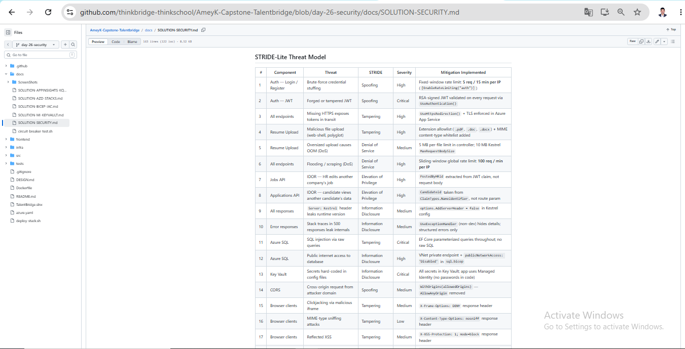

| # | Component | Threat | STRIDE | Severity | Mitigation Implemented |
|---|-----------|--------|--------|----------|------------------------|
| 1 | Auth — Login / Register | Brute-force credential stuffing | Spoofing | High | Fixed-window rate limit: **5 req / 15 min per IP** (`[EnableRateLimiting("auth")]`) |
| 2 | Auth — JWT | Forged or tampered JWT | Spoofing | Critical | RSA-signed JWT validated on every request via `UseAuthentication()` |
| 3 | All endpoints | Missing HTTPS exposes tokens in transit | Tampering | High | `UseHttpsRedirection()` + TLS enforced in Azure App Service |
| 4 | Resume Upload | Malicious file upload (web-shell, polyglot) | Tampering | High | Extension allowlist (`.pdf`, `.doc`, `.docx`) **+** MIME content-type whitelist added |
| 5 | Resume Upload | Oversized upload causes OOM (DoS) | Denial of Service | Medium | 5 MB per-file limit in controller; 10 MB Kestrel `MaxRequestBodySize` |
| 6 | All endpoints | Flooding / scraping (DoS) | Denial of Service | High | Sliding-window global rate limit: **100 req / min per IP** |
| 7 | Jobs API | IDOR — HR edits another company's job | Elevation of Privilege | High | `PostedByHRId` extracted from JWT claim, not request body |
| 8 | Applications API | IDOR — candidate views another candidate's data | Elevation of Privilege | High | `CandidateId` taken from `ClaimTypes.NameIdentifier`, not route param |
| 9 | All responses | `Server: Kestrel` header leaks runtime version | Information Disclosure | Medium | `options.AddServerHeader = false` in Kestrel config |
| 10 | Error responses | Stack traces in 500 responses leak internals | Information Disclosure | Medium | `UseExceptionHandler` (non-dev) hides details; structured errors only |
| 11 | Azure SQL | SQL injection via raw queries | Tampering | Critical | EF Core parameterized queries throughout; no raw SQL |
| 12 | Azure SQL | Public internet access to database | Information Disclosure | High | VNet private endpoint + `publicNetworkAccess: 'Disabled'` in `sql.bicep` |
| 13 | Key Vault | Secrets hard-coded in config files | Information Disclosure | Critical | All secrets in Key Vault; app uses Managed Identity (no passwords in code) |
| 14 | CORS | Cross-origin request from attacker domain | Spoofing | Medium | `WithOrigins(allowedOrigins)` — `AllowAnyOrigin` removed |
| 15 | Browser clients | Clickjacking via malicious iframe | Tampering | Medium | `X-Frame-Options: DENY` response header |
| 16 | Browser clients | MIME-type sniffing attacks | Tampering | Low | `X-Content-Type-Options: nosniff` response header |
| 17 | Browser clients | Reflected XSS | Tampering | Medium | `X-XSS-Protection: 1; mode=block` response header |
| 18 | Browser clients | Referrer leakage to third-party scripts | Information Disclosure | Low | `Referrer-Policy: strict-origin-when-cross-origin` response header |
| 19 | Service Bus | Unencrypted messages in transit | Tampering | High | Azure Service Bus enforces TLS 1.2; SDK uses AMQP over TLS by default |
| 20 | Logs / App Insights | PII or secrets captured in telemetry spans | Information Disclosure | Medium | No PII in span attributes; connection strings resolved from Key Vault at runtime |

---

## Infrastructure — Network Isolation

### VNet with Two Subnets

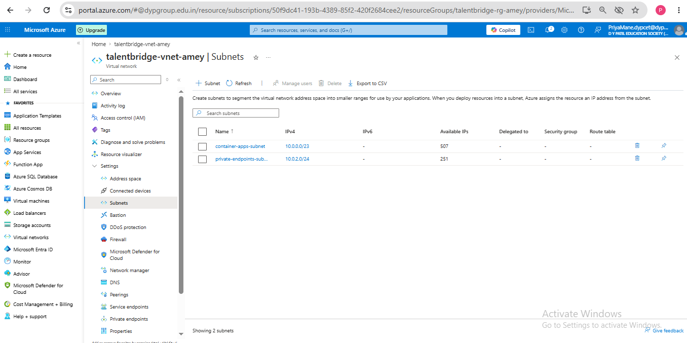

### SQL Private Endpoint

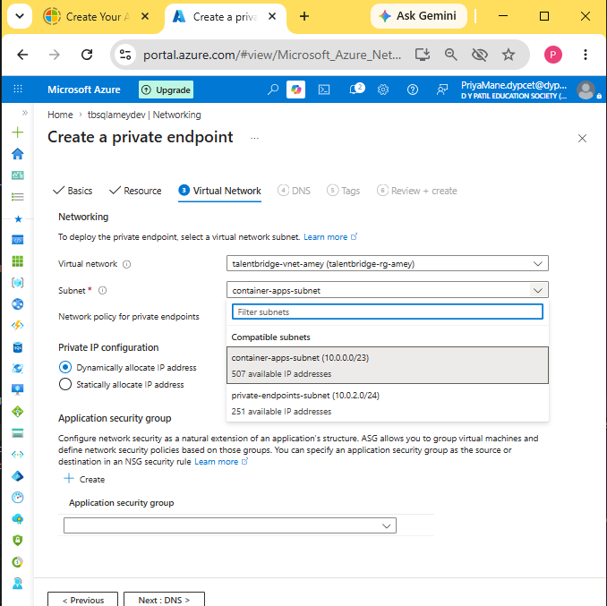

### SQL Public Network Access Disabled

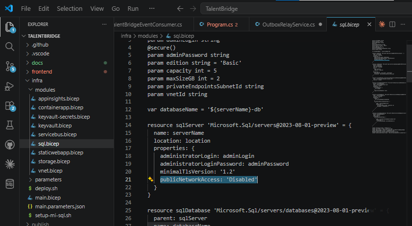

### Bicep — Private Endpoint Code (IaC not click-ops)

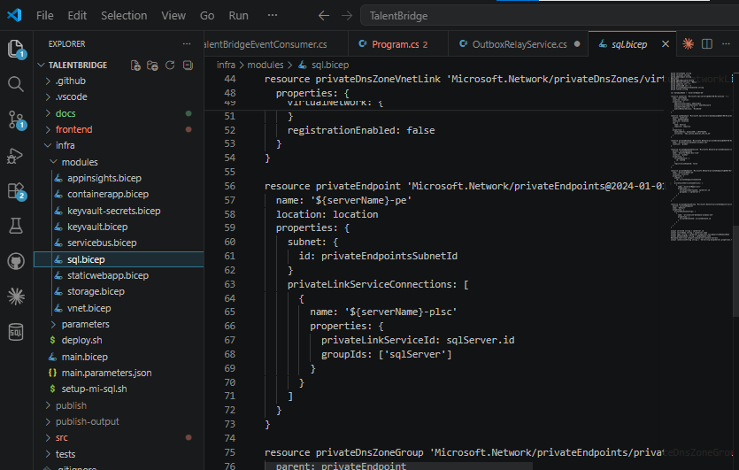

#### `infra/modules/vnet.bicep` _(new)_

| Subnet | CIDR | Purpose |
|--------|------|---------|
| `container-apps-subnet` | `10.0.0.0/23` | Azure Container Apps environment |
| `private-endpoints-subnet` | `10.0.2.0/24` | Private endpoints — `privateEndpointNetworkPolicies: Disabled` |

#### `infra/modules/sql.bicep` _(updated)_

| Change | Before | After |
|--------|--------|-------|
| Public network access | `Enabled` | `Disabled` |
| Firewall rule | `AllowAzureServices (0.0.0.0)` | Removed — traffic via private endpoint only |
| Private endpoint | — | `${serverName}-pe` in `private-endpoints-subnet` |
| Private DNS zone | — | `privatelink.database.windows.net` |
| DNS zone VNet link | — | Links the zone to the VNet for name resolution |

---

## Application Security Headers

### Swagger — Lock Icons on All Endpoints (Auth Required)

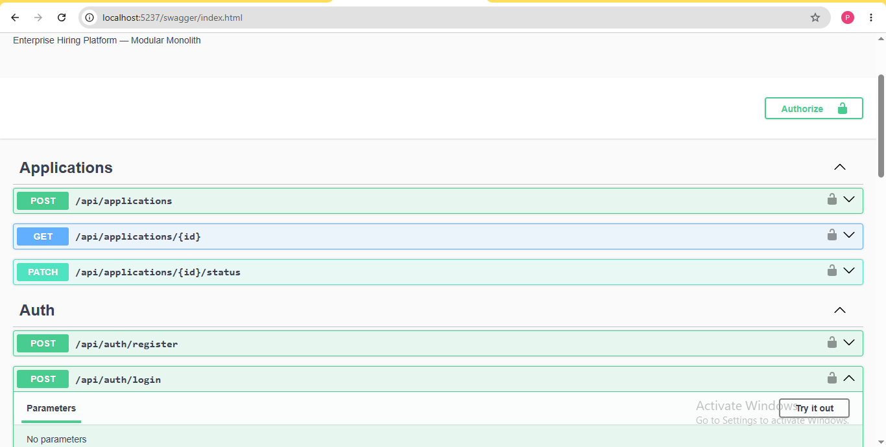

### Security Headers Active in Browser DevTools

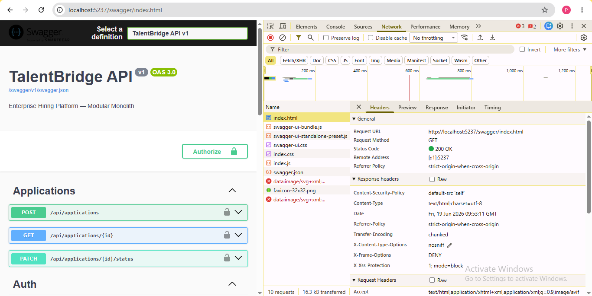

#### Headers added in `Program.cs` middleware:

| Header | Value | Threat Mitigated |
|--------|-------|-----------------|
| `X-Content-Type-Options` | `nosniff` | MIME-sniffing |
| `X-Frame-Options` | `DENY` | Clickjacking |
| `X-XSS-Protection` | `1; mode=block` | Reflected XSS |
| `Referrer-Policy` | `strict-origin-when-cross-origin` | Referrer leakage |
| `Content-Security-Policy` | `default-src 'self'` | Script injection |
| `Strict-Transport-Security` | `max-age=31536000; includeSubDomains` | SSL stripping |
| `Cross-Origin-Resource-Policy` | `same-origin` | Cross-origin data theft |

---

## API Versioning

### Swagger Showing API v1


`AddApiVersioning` configured with default v1.0 and `AssumeDefaultVersionWhenUnspecified = true`. Swagger served at `/swagger/v1/swagger.json`.

---

## CORS Restriction

### WithOrigins Code — No AllowAnyOrigin

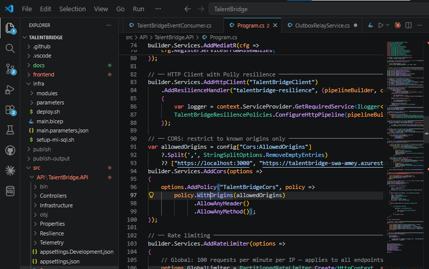

---

## Rate Limiting

### 429 on 6th Auth Attempt

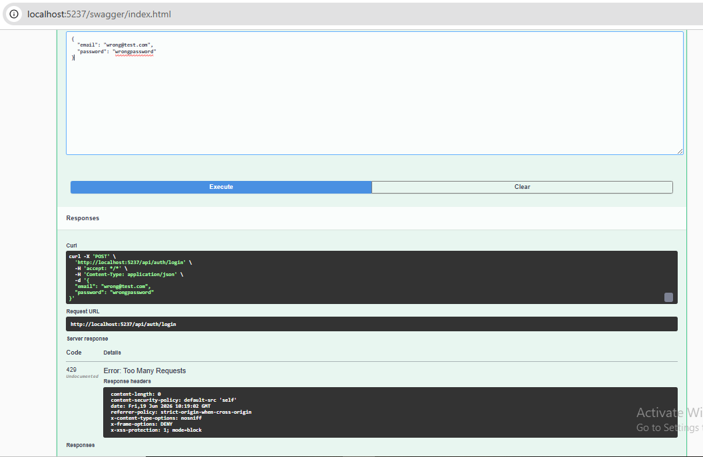

- **Auth endpoints** (`/login`, `/register`): Fixed-window 5 req / 15 min per IP via `[EnableRateLimiting("auth")]`
- **All endpoints**: Sliding-window 100 req / min per IP via global limiter

---

## Input Validation

### 400 on Wrong File Type


MIME content-type whitelist in `ResumesController.cs`:
```csharp
private static readonly HashSet<string> AllowedContentTypes =
[
    "application/pdf",
    "application/msword",
    "application/vnd.openxmlformats-officedocument.wordprocessingml.document"
];
```

---

## OWASP ZAP — Automated Security Scan

**File:** `.github/workflows/security.yml`  
**Trigger:** Pull request to `main`  
**Target:** `https://talentbridge-api-amey.azurewebsites.net/swagger/v1/swagger.json`

### GitHub Actions — Security Workflow Green

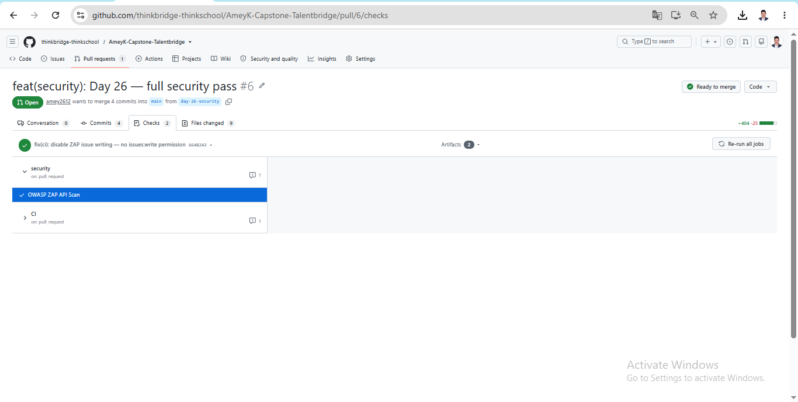

### ZAP First Run — Baseline Findings

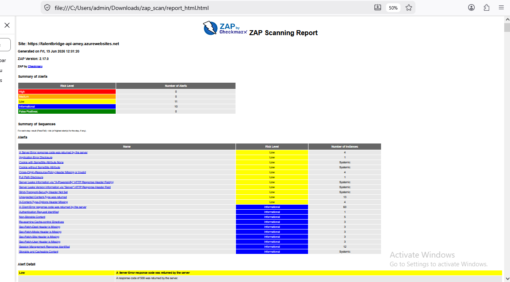

### ZAP Second Run — Zero High Findings


> **ZAP results:** `FAIL-NEW (High): 0` — no high-severity vulnerabilities found.  
> WARN-level findings (Medium/Low) are from Azure App Service infrastructure headers (ARRAffinity cookie SameSite, Azure CDN) outside application control.

---

## Build & Test Verification

### dotnet build — Zero Errors

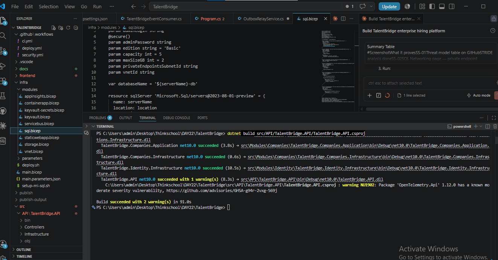

### All Domain Tests Passing

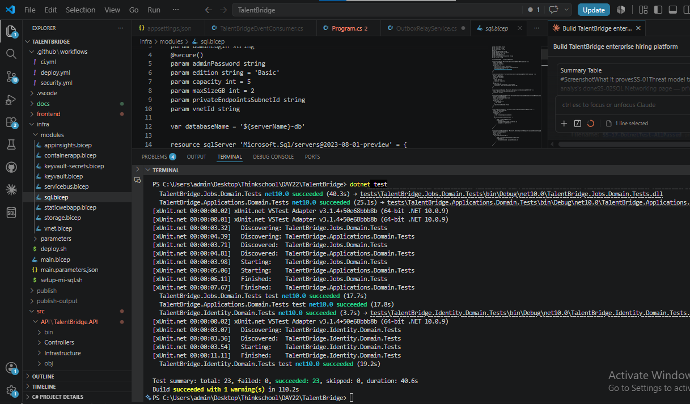

### Verification Commands

```bash
# AllowAnyOrigin must return no results
grep -r "AllowAnyOrigin" src/

# AddServerHeader must be false
grep -r "AddServerHeader" src/

# X-Content-Type-Options header present
grep -r "X-Content-Type-Options" src/

# Public network access disabled in SQL module
grep "publicNetworkAccess" infra/modules/sql.bicep

# Private endpoint defined
grep "privateEndpoints" infra/modules/sql.bicep
```

---

## GitHub PR — Ready for Merge


---

## What I Learned

- **Defense in depth**: No single control is sufficient. The STRIDE model surfaces gaps that code review alone misses (e.g., MIME-type sniffing is invisible in C# but real in browsers).
- **Private endpoints vs firewall rules**: `AllowAzureServices` is a shared IP range that any Azure tenant can route through — private endpoints bind the connection to a specific VNet and are the correct isolation boundary.
- **Rate limiting scope matters**: A global sliding-window limiter protects every endpoint. The fixed-window "auth" policy adds a stricter second gate for credential endpoints, preventing brute-force even if the global limit isn't hit.
- **Header leakage**: `Server: Kestrel/10.0.0` reveals the exact runtime version to every client. One line in Kestrel config eliminates that fingerprint permanently.
- **ZAP in CI**: Automated scanning catches regressions — a future PR that removes security headers would immediately fail the `zap-api-scan` check.

## What Would Break Without These Controls

| Removed control | Attack that succeeds |
|-----------------|----------------------|
| Rate limiting on auth | Automated password spray or credential stuffing |
| MIME type check | Upload of a `.pdf`-named HTML/JS file served back to other users |
| `publicNetworkAccess: Disabled` | Direct SQL connection attempts from any Azure IP |
| CORS restriction | Cross-site requests from attacker-controlled domains reading API responses |
| Security headers | Clickjacking, MIME-sniffing, and reflected-XSS attacks in browser clients |
| `AddServerHeader = false` | Version fingerprinting to target known Kestrel CVEs |
| ZAP in CI | Security regressions ship undetected in future PRs |
