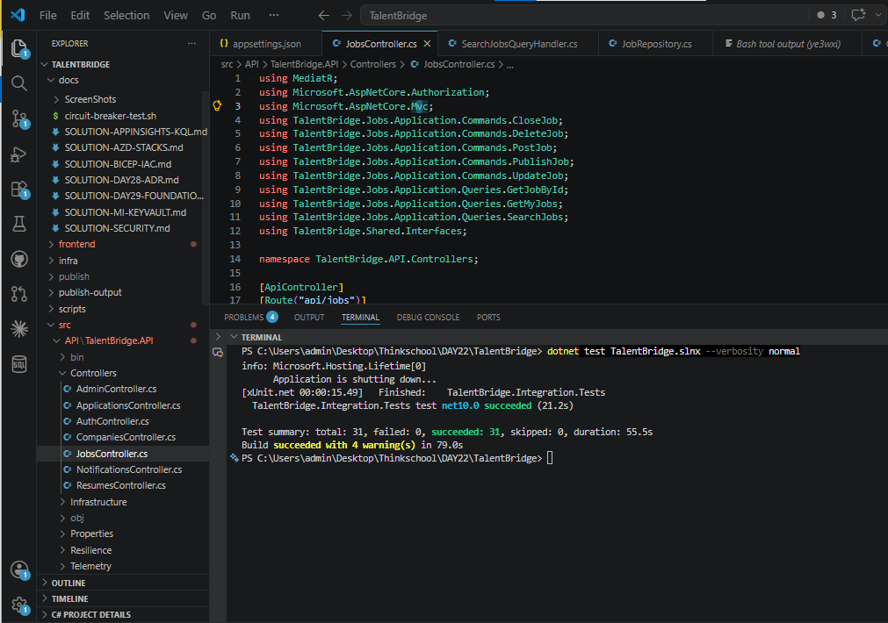

# TalentBridge — Project Submission (Day 30)

**Submitted by:** Amey Khot  
**GitHub:** https://github.com/thinkbridge-thinkschool/AmeyK-Capstone-Talentbridge  
**Live PR:** https://github.com/thinkbridge-thinkschool/AmeyK-Capstone-Talentbridge/pull/9

---

## What is TalentBridge?

TalentBridge is a full-stack hiring platform where companies post jobs and candidates apply. HR managers review applications, move them through a hiring pipeline (Submitted → Under Review → Shortlisted → Accepted/Rejected), and candidates receive real-time notifications at every step.

---

## How to Run Locally

### Prerequisites
- .NET 10 SDK
- Node.js 20+
- SQL Server (or use the InMemory test configuration)
- Azure CLI (`az login`) for Blob/Service Bus in dev

### Backend
```bash
cd src/API/TalentBridge.API
dotnet run
# API available at https://localhost:7001
```

### Frontend
```bash
cd frontend
npm install
ng serve
# App available at http://localhost:4200
```

### Run All Tests
```bash
dotnet test TalentBridge.slnx
# 32 tests pass — 0 failures
```

---

## Demo Accounts

Log in at `http://localhost:4200` with any of these:

| Role | Email | Password | What you can do |
|---|---|---|---|
| Admin | admin@talentbridge.com | Admin@1234 | Manage users, approve companies, view everything |
| HR Manager | hr@talentbridge.com | HR@1234 | Post jobs, review applicants, update status |
| Candidate | candidate@talentbridge.com | Candidate@1234 | Search jobs, apply, track application status |

Seed data includes **3 published jobs** and **2 sample applications** ready to explore.

---

## Features

### For Candidates
- Browse and search jobs by keyword, location, and salary range
- Apply with a cover letter and resume URL
- Track all applications and their current status
- Withdraw an application at any time
- Get notifications when your application status changes (shortlisted, accepted, rejected)
- Edit your profile (bio, skills, LinkedIn, GitHub, resume link)

### For HR Managers
- Create job postings (saved as Draft, then Published)
- View all applicants for each job
- Move applicants through the pipeline: Submitted → Under Review → Shortlisted → Accepted
- Reject with a reason at any point
- Close job listings when filled

### For Admins
- Approve company profiles
- Deactivate user accounts
- View all users and companies

---

## Application Status Flow

```
Submitted
    │
    ▼
Under Review ──► Rejected
    │
    ▼
Shortlisted ──► Rejected
    │
    ▼
Accepted

(Candidate can Withdraw at any point)
```

---

## Architecture

TalentBridge is built as a **Modular Monolith** — five independent bounded contexts inside one deployable API. Each module owns its own database tables and never directly accesses another module's data.

```
┌─────────────────────────────────────────────────────────┐
│                  Angular 19 Frontend                    │
└────────────────────────┬────────────────────────────────┘
                         │ HTTP / REST
┌────────────────────────▼────────────────────────────────┐
│               ASP.NET Core 10 API                       │
│  ┌──────────┐ ┌──────┐ ┌────────────┐ ┌─────────────┐  │
│  │ Identity │ │ Jobs │ │Applications│ │Notifications│  │
│  └──────────┘ └──────┘ └────────────┘ └─────────────┘  │
│  ┌───────────┐                                          │
│  │ Companies │                                          │
│  └───────────┘                                          │
└─────────────────────────┬───────────────────────────────┘
                          │
       ┌──────────────────┼──────────────────┐
       ▼                  ▼                  ▼
  Azure SQL DB    Azure Service Bus    Azure Blob Storage
  (5 contexts)   (event messaging)    (resume uploads)
```

### Key Patterns Used
| Pattern | Where |
|---|---|
| CQRS + MediatR | Every feature is a Command or Query handler |
| Domain Events + Outbox | Status changes publish events atomically with the DB write |
| Railway-Oriented Result\<T\> | No exceptions for business errors — explicit success/failure |
| Repository-free (EF Core) | DbContext used directly in handlers — no unnecessary abstraction |
| JWT HS256 + Refresh Tokens | Stateless auth with 15-min access / 7-day refresh token pair |
| HybridCache | 2-min in-process + 10-min distributed cache for job search |
| Polly Resilience Pipeline | Circuit breaker + retry + timeout on outbound calls |

---

## Tech Stack

| Area | Technology |
|---|---|
| Backend | ASP.NET Core 10, C# 13, .NET 10 |
| ORM | Entity Framework Core 10 |
| Messaging | MediatR v14, FluentValidation |
| Auth | JWT Bearer, BCrypt.Net (work factor 11) |
| Cloud | Azure App Service, Azure SQL, Azure Service Bus, Azure Blob, Azure Static Web Apps |
| Frontend | Angular 19, TypeScript 5.6, RxJS, Tailwind CSS |
| Testing | xUnit, FluentAssertions, WebApplicationFactory, EF InMemory |
| CI/CD | GitHub Actions with Cobertura coverage report |
| IaC | Azure Bicep |
| Observability | OpenTelemetry → Azure Application Insights |

---

## API Reference

### Authentication
| Endpoint | Method | Auth | Description |
|---|---|---|---|
| `/api/identity/register` | POST | Public | Create account |
| `/api/identity/login` | POST | Public | Get JWT token |
| `/api/identity/refresh` | POST | Public | Refresh token |
| `/api/identity/me` | GET | Bearer | Current user info |
| `/api/identity/profile` | PATCH | Bearer | Update profile |

### Jobs
| Endpoint | Method | Auth | Description |
|---|---|---|---|
| `/api/jobs/search` | GET | Public | Search/filter jobs |
| `/api/jobs/{id}` | GET | Public | Job detail |
| `/api/jobs` | POST | HR/Admin | Create job |
| `/api/jobs/{id}/publish` | POST | HR/Admin | Publish a draft job |
| `/api/jobs/{id}/close` | PATCH | HR/Admin | Close job listing |
| `/api/jobs/{id}` | PUT | HR/Admin | Update job |
| `/api/jobs/{id}` | DELETE | HR/Admin | Delete job |
| `/api/jobs/mine` | GET | HR/Admin | My job postings |

### Applications
| Endpoint | Method | Auth | Description |
|---|---|---|---|
| `/api/applications` | POST | Candidate | Apply to a job |
| `/api/applications/my` | GET | Candidate | My applications |
| `/api/applications/{id}` | GET | Bearer | Application detail |
| `/api/applications/{id}/status` | PATCH | HR/Admin | Update status |
| `/api/applications/{id}/withdraw` | PATCH | Candidate | Withdraw application |
| `/api/applications/{id}/history` | GET | Bearer | Full status history |

### Notifications
| Endpoint | Method | Auth | Description |
|---|---|---|---|
| `/api/notifications` | GET | Bearer | All notifications |
| `/api/notifications/{id}/read` | PATCH | Bearer | Mark as read |

### Other
| Endpoint | Method | Auth | Description |
|---|---|---|---|
| `/api/resumes/upload` | POST | Candidate | Upload resume to Azure Blob |
| `/api/companies` | POST | HR/Admin | Create company |
| `/api/admin/users` | GET | Admin | All users |
| `/api/admin/users/{id}/deactivate` | PATCH | Admin | Deactivate user |
| `/api/admin/companies/{id}/approve` | PATCH | Admin | Approve company |

---

## Tests — 32/32 Passing



```
Suite                                    Tests   Result
────────────────────────────────────────────────────────
Identity.Domain.Tests                      7     ✓ PASS
Jobs.Domain.Tests                          8     ✓ PASS
Applications.Domain.Tests                  8     ✓ PASS
Integration.Tests (HTTP end-to-end)        9     ✓ PASS
────────────────────────────────────────────────────────
Total                                     32     0 failed
```

### Integration Test Coverage
The integration tests spin up the full ASP.NET Core pipeline (no mocks) and exercise real HTTP flows:

- Register + duplicate email guard
- Login → JWT token returned
- Wrong password → 401
- Job search without auth → 200
- Post job without auth → 401
- Post job as HR → 201 + jobId returned
- **Full E2E hiring flow** (12 steps):
  HR registers → posts job → Candidate registers → applies → HR reviews → HR shortlists → Candidate sees "Shortlisted"

---

## Cloud Infrastructure (Azure)

All resources provisioned via Bicep IaC in `infra/`:

| Resource | Role |
|---|---|
| Azure App Service | Hosts the .NET API |
| Azure SQL Database | Persistent storage (separate schema per module) |
| Azure Service Bus | Async event delivery (application status changes → notifications) |
| Azure Blob Storage | Resume file storage (5 MB max, PDF/DOC/DOCX) |
| Azure Static Web Apps | Hosts the Angular SPA |
| Azure Application Insights | Distributed traces, logs, exceptions |
| Azure Key Vault | Secrets management |

All services authenticate via **Managed Identity** — no passwords in code or config files.

---

## CI/CD

Every push and pull request to `main` runs:

1. Restore NuGet packages
2. Build in Release mode
3. Run all 32 tests with code coverage (Cobertura)
4. Upload coverage report as a GitHub artifact

---

## Submission PRs

| PR | Description |
|---|---|
| [#9 — day-31-polish-tests-perf-security](https://github.com/thinkbridge-thinkschool/AmeyK-Capstone-Talentbridge/pull/9) | Integration tests, E2E happy path, CI coverage collection |
| #8 — feature/angular-frontend | Full Angular 19 SPA (all feature modules) |
| Earlier PRs | Core backend: modular monolith, auth, jobs, applications, companies, notifications, Azure deployment, Bicep IaC |
